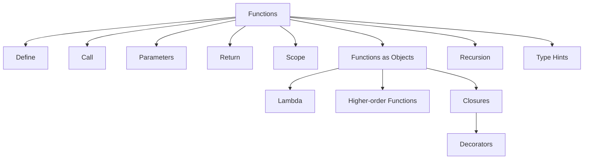

# Python Learning Lab — المخطط الكامل لمنصة تفاعلية لتعلّم Python

> **نوع الوثيقة:** Product + Curriculum + UX + Technical Blueprint  
> **الواجهة المقترحة:** Streamlit Multipage App  
> **لغة الشرح:** العربية مع إبقاء المصطلحات التقنية الإنجليزية كما هي عند الحاجة  
> **نطاق التعلّم:** من مرحلة «ما قبل الصفر» إلى Python المتقدم، ثم NumPy وpandas وData Visualization وDatabases وImages وأدوات جودة الكود والمكتبات العلمية والعملية  
> **مبدأ أساسي:** لا توجد فقرة نظرية معزولة عن تجربة. كل مفهوم يجب أن يمرّ عبر: شرح → نموذج ذهني → كود → Run → Output → تفسير → Visual/Animation → خطأ شائع → تمرين → Lab.

---

## 0. لماذا هذه المنصة؟

المنصة ليست كتابًا إلكترونيًا ولا مجموعة أكواد متناثرة، بل **مختبر تعلّم تفاعلي Interactive Learning Lab**. الباحث أو الطالب لا يقرأ فقط أن `for` تكرر التعليمات، بل يرى مؤشرًا يتحرك على عناصر القائمة، ويرى قيمة المتغير تتغير في كل دورة، ويرى متى يتحقق `break` أو `continue`. وعندما يضغط `Run` يجب ألا تظهر النتيجة فقط؛ بل يمكنه فتح تبويبات تشرح: ما الذي طُبع؟ ما القيمة التي أعادتها الدالة؟ ما المتغيرات التي أصبحت موجودة؟ ما نوع كل متغير؟ هل ظهر Warning؟ هل حدث Exception؟ أين وقع الخطأ؟ وما الفرق بين ما يحدث في `.py` وبين Notebook؟

الهدف هو أن يتكوّن لدى المتعلم **Mental Model** صحيح عن Python قبل أن يحفظ syntax. لذلك يجب أن تكون المنصة صالحة للمبتدئ، وفي الوقت نفسه لا تتوقف عند المستوى السطحي؛ بل تفتح طبقات أعمق لمن يريد معرفة التنفيذ، الذاكرة، object model، iterators، decorators، generators، typing، packaging، testing، profiling وغير ذلك.

---

# 1. الأهداف التعليمية الكبرى

بنهاية المسار يجب أن يكون المتعلم قادرًا على:

1. فهم الفرق بين Python كلغة، وCPython كـ implementation، وInterpreter، وREPL، وscript، وnotebook، وkernel.
2. قراءة وكتابة وتشغيل ملفات `.py` و`.ipynb` وفهم اختلاف نموذج التنفيذ بينهما.
3. استخدام Terminal/CMD/PowerShell، المسارات، البيئة الافتراضية، `pip` و`venv` و`uv` وبيئة Jupyter kernel.
4. فهم syntax من جذوره: tokens، keywords، identifiers، expressions، statements، indentation، comments، docstrings، strings، escape sequences.
5. التعامل العميق مع built-in data types وdata structures، والتحويل بينها، ومشكلات mixed data.
6. كتابة `if` و`match` وloops وفهم مسار التنفيذ visually.
7. بناء Functions بصورة صحيحة وفهم `print` مقابل `return`، scope، arguments، `*args` و`**kwargs`، lambda، first-class functions، higher-order functions، closures، recursion.
8. فهم iterables/iterators/generators و`yield` مع animation لحالة التنفيذ pause/resume.
9. فهم decorators وكيف تغلف function أخرى، مع visualization للـ wrapper call chain.
10. فهم Exceptions وWarnings وTracebacks وDebugging بدل النظر إليها كرسائل مخيفة.
11. بناء Modules وPackages وفهم import system بصورة عملية.
12. التعامل مع Regular Expressions بصورة بصرية وتفاعلية.
13. فهم OOP من object/class حتى inheritance، composition، polymorphism، properties، dataclasses، dunder methods، MRO، protocols، وموضوعات متقدمة اختيارية.
14. التعامل مع الملفات والنصوص وCSV/JSON/Excel/Parquet وقواعد البيانات.
15. تعلم NumPy بتركيز على ndarray، shape، dtype، indexing، broadcasting، vectorization، ufuncs، statistics، linear algebra.
16. تعلم pandas من Series/DataFrame إلى cleaning، missing values، duplicates، joins، groupby، reshaping، time series، categorical، I/O، performance.
17. بناء Data Visualization سليمة باستخدام Matplotlib، ثم التعرف على Seaborn/Plotly/Altair حسب الحاجة.
18. التعامل مع الصور بواسطة Pillow/OpenCV على مستوى pixels/arrays/channels.
19. استخدام الأدوات الاحترافية: Ruff، formatter، linter، type checker، pytest، debugger، logging، profiling، pre-commit.
20. الانتقال من ملف تعليمي صغير إلى مشروع Python حقيقي له `pyproject.toml`، اختبارات، توثيق، حزمة، وبيئة قابلة لإعادة الإنتاج.

---

# 2. فلسفة التدريس داخل كل Lesson

كل درس في المنصة يجب أن يتبع **قالبًا موحدًا** كي لا تتحول المنصة إلى صفحات متفاوتة الجودة.

## 2.1 قالب الدرس القياسي

كل Lesson يحتوي على الأقسام التالية، ويجوز إخفاء بعضها عندما لا تكون مناسبة:

1. **What & Why** — ما المفهوم؟ ولماذا نحتاجه؟
2. **Before You Code** — ما المعرفة السابقة المطلوبة؟
3. **Mental Model** — رسم أو animation يشرح الفكرة قبل syntax.
4. **Syntax Anatomy** — تشريح السطر أو البنية token by token.
5. **Minimal Example** — أصغر مثال صحيح.
6. **Predict First** — يطلب من المتعلم توقع الناتج قبل الضغط على Run.
7. **Run It** — محرر كود + زر Run.
8. **Output Inspector** — الناتج مع عدة تبويبات.
9. **Explain This Code** — شرح سطر بسطر أو block by block.
10. **What Python Sees** — type، object identity، value، shape/dtype عند الحاجة.
11. **Common Mistake** — خطأ حقيقي مع traceback وتفسير.
12. **Warning Corner** — warning أو caveat إن وجد.
13. **Try Variations** — تغيير قيمة أو type وملاحظة الفرق.
14. **Mini Exercise** — تمرين قصير جدًا.
15. **Guided Lab** — تمرين متدرج hints.
16. **Challenge** — تمرين من دون خطوات.
17. **Researcher Use Case** — مثال من بيانات/بحث/تحليل عندما يكون مناسبًا.
18. **Cheat Sheet** — ملخص قابل للطي.
19. **Glossary** — المصطلحات العربية/الإنجليزية.
20. **Official Docs** — روابط التوثيق الرسمي.

## 2.2 مستويات العمق داخل الصفحة نفسها

بدل إنشاء محتوى منفصل للمبتدئ والمتقدم، تستخدم الصفحة ثلاث طبقات:

- **Basic:** الفكرة + syntax + مثال بسيط.
- **Deep Dive:** لماذا تعمل بهذه الطريقة، edge cases، object model، performance.
- **Under the Hood:** التنفيذ الداخلي بصورة مبسطة: bytecode عند الحاجة، iterator protocol، function frames، MRO، descriptor protocol… إلخ.

بهذا يستطيع المبتدئ إكمال المسار من دون إرباك، ويستطيع الباحث المتقدم فتح التفاصيل عند الحاجة.

---

## 2.3 الوحدة التعليمية الأساسية ليست "صفحة" بل محاضرة كاملة

في هذه المنصة، **Lecture** هي الوحدة التعليمية الأساسية. لا تُبنى الصفحة على شكل تعريف قصير ثم كود، بل على شكل محاضرة لها قصة تعليمية واضحة تبدأ من المشكلة وتنتهي بقدرة المتعلم على استخدام المفهوم في مشروع أو سياق بحثي.

كل محاضرة يجب أن تجيب عن الأسئلة الآتية بالترتيب:

1. **ما المشكلة التي نحاول حلها؟**
2. **ما الفكرة قبل أن نرى Python syntax؟**
3. **كيف نمثل الفكرة بصريًا؟**
4. **كيف تُكتب في Python؟**
5. **ماذا يحدث لحظة بلحظة عند التنفيذ؟**
6. **ماذا يرى Python من types/objects/values؟**
7. **ما الحالات الخاصة والحدود والأخطاء؟**
8. **ما البدائل؟ ومتى نختار كل بديل؟**
9. **أين سيستعمل الباحث هذه الفكرة في Data/Statistics/Econometrics/AI؟**
10. **كيف أتأكد أن المتعلم فهمها ولم يحفظها فقط؟**

### البنية المقترحة لكل محاضرة

```text
Opening Question
      ↓
Intuition / Real Problem
      ↓
Concept Map
      ↓
Visual Explanation / Diagram
      ↓
Syntax Anatomy
      ↓
Minimal Example
      ↓
Predict the Output
      ↓
Run & Inspect
      ↓
Animation / Step Execution
      ↓
Change One Thing
      ↓
Common Errors + Why
      ↓
Research Use Case
      ↓
Guided Lab
      ↓
Challenge
      ↓
Sketchnote + Cheat Sheet
      ↓
Self-check / Exit Ticket
```

المهم أن يشعر المستخدم أنه حضر **محاضرة حقيقية**، لا أنه تصفح Documentation.

---

## 2.4 Storyline للمحاضرة

كل Lecture يجب أن تُكتب كقصة معرفية قصيرة مترابطة. مثال محاضرة `return` و`print`:

- نبدأ بسؤال: "لماذا أستطيع رؤية نتيجة `print()` لكن لا أستطيع تخزينها في متغير؟"
- نجعل المتعلم يتوقع الناتج.
- ننفذ المثال.
- نعرض Call Frame بصريًا.
- نوضح أن `print()` يرسل نصًا إلى stdout بينما `return` يرسل object إلى caller.
- نغير الدالة من `print` إلى `return` ونشاهد الفرق في Variable Inspector.
- نعرض الخطأ المفاهيمي الشائع: `x = print(5)`.
- ننتهي بمثال بحثي: دالة تُرجع summary statistics ليُعاد استخدامها في تقرير أو pipeline.

بهذا يصبح المفهوم مرتبطًا بسبب واضح وليس بقاعدة محفوظة.

---

## 2.5 Concept Map في بداية كل موضوع كبير

كل Module رئيسي يجب أن يحتوي Concept Map تفاعلية تبين أين نحن داخل الصورة الكبرى. مثال Functions:



يجب أن يستطيع المتعلم النقر على العقدة للذهاب إلى Lesson المقابلة، مع تلوين العقدة الحالية والعقد المكتملة.

---

## 2.6 Sketchnote System — الملاحظات البصرية المختصرة

كل محاضرة طويلة يجب أن تنتهي أو تتخللها **Sketchnotes**: بطاقات بصرية تلخص المفهوم بصورة قابلة للتذكر.

الـSketchnote ليست paragraph مختصرًا؛ بل تجمع:

- كلمة مفتاحية كبيرة.
- رسم بسيط أو أيقونة.
- علاقة أو سهم.
- مثال واحد فقط.
- خطأ شائع واحد.
- قاعدة عملية.

### مثال Sketchnote: `list` مقابل `tuple`

```text
┌──────────────────────────────────────────────────────┐
│ LIST                              TUPLE               │
│ [ ]                               ( )                 │
│ Mutable                           Immutable           │
│ append/remove                     no append/remove    │
│                                                      │
│ names = ["A", "B"]              point = (4, 7)      │
│                                                      │
│ Think: collection that changes   Think: fixed record │
└──────────────────────────────────────────────────────┘
```

### أنواع Sketchnotes داخل المنصة

1. **One Concept Card** — مفهوم واحد.
2. **A vs B** — مقارنة مفهومين.
3. **Do / Don't** — أفضل ممارسة مقابل خطأ.
4. **Execution Sketch** — خطوات التنفيذ.
5. **Decision Sketch** — متى أستخدم هذا أم ذاك؟
6. **Research Sketch** — أين يظهر المفهوم داخل workflow بحثي.

يمكن للمستخدم حفظ Sketchnote في Bookmarks أو فتحها في وضع مراجعة سريع.

---

## 2.7 Visual Note Blocks

بدل النص المتتابع، تستخدم المحاضرات Blocks ذات وظيفة ثابتة:

> **الفكرة Intuition**  
> شرح الفكرة بلغة مفهومة قبل syntax.

> **لماذا يهم الباحث؟ Research Note**  
> ربط المفهوم بمشكلة بحثية أو تحليل بيانات.

> **انتبه Warning**  
> سلوك قد يؤدي إلى نتيجة خاطئة أو كود مضلل.

> **خطأ شائع Common Mistake**  
> مثال قصير على خطأ يحدث فعلًا.

> **Deep Dive**  
> طبقة أعمق اختيارية للمستخدم المتقدم.

> **Under the Hood**  
> ماذا يحدث في Python داخليًا؟

> **قاعدة سريعة Rule of Thumb**  
> قاعدة عملية تساعد عند اتخاذ قرار.

> **جرّب بنفسك Try It**  
> تغيير محدد في الكود ورؤية النتيجة.

> **سؤال تفكير Think**  
> سؤال conceptual لا يتطلب كتابة كود دائمًا.

يجب أن تكون لهذه البطاقات هوية بصرية ثابتة على مستوى المنصة كلها.

---

## 2.8 Diagram Library — مكتبة الرسومات التعليمية

المنصة تحتاج مكتبة رسوم قابلة لإعادة الاستخدام بدل رسم كل درس من الصفر.

### A. Flow Diagrams

لـ:
- `if / elif / else`
- loops
- exception flow
- function call
- import resolution
- file read/write lifecycle

### B. Object & Memory Diagrams

لـ:
- variables and references
- mutability
- shallow/deep copy
- list of lists
- NumPy view vs copy
- pandas indexing

### C. Structure Diagrams

لـ:
- package/module/project structure
- `.py` مقابل `.ipynb`
- Jupyter kernel architecture
- class/object relationships
- inheritance/composition

### D. Data Transformation Diagrams

لـ:
- `map/filter/reduce`
- DataFrame transformations
- `groupby`
- merge/join
- reshape/pivot/melt
- data cleaning pipeline

### E. Timeline Diagrams

لـ:
- datetime operations
- generator execution
- async execution
- function call stack

### F. Decision Diagrams

لـ:
- list أم tuple؟
- loop أم comprehension؟
- function أم method؟
- CSV أم Parquet؟
- pandas أم NumPy؟
- `loc` أم `iloc`؟
- `print` أم `return`؟

---

## 2.9 ثلاثة أوضاع لعرض نفس المحاضرة

حتى تكون المنصة مناسبة للتعلم وللمراجعة وللباحث الذي يريد مرجعًا سريعًا، كل Lecture يمكن فتحها بثلاثة أوضاع:

### Learn Mode
المحاضرة الكاملة: شرح + رسومات + animation + code + labs.

### Review Mode
يعرض فقط:
- Concept map
- Sketchnotes
- Key rules
- Common mistakes
- Cheat sheet

### Reference Mode
يعرض:
- syntax
- parameters
- common methods
- examples
- links to related lessons
- official docs references

لا يُنشأ محتوى منفصل بالكامل لهذه الأوضاع؛ بل يعاد تركيب نفس المحتوى structured content وفق الغرض.

---

## 2.10 "غيّر وشاهد" Change & Observe

بعد كل مثال مهم يجب ألا يكتفي المتعلم بالضغط على Run. تظهر له اقتراحات صغيرة مثل:

- غيّر `int` إلى `float`.
- احذف `return`.
- استبدل `<` بـ`<=`.
- ضع `break` في مكان مختلف.
- استبدل list بـtuple.
- غيّر `axis=0` إلى `axis=1`.
- استخدم `copy()` ثم عدّل الأصل.

ثم تعرض المنصة **Before / After** وتشرح لماذا تغير الناتج.

هذه الوحدة ضرورية لأنها تنقل المتعلم من الحفظ إلى فهم causal behavior للكود.

---

## 2.11 محاضرة كاملة يجب أن تتضمن مستوى نظريًا حقيقيًا

الشروحات لا تقتصر على تعريف الدالة. مثلًا محاضرة Data Types يجب أن تشمل:

- معنى type أصلًا.
- الفرق بين value وtype وobject.
- لماذا يوجد أكثر من numeric type.
- conversion مقابل coercion.
- mixed types.
- ماذا يحصل في العمليات بين أنواع مختلفة.
- `type()` و`isinstance()`.
- truthiness.
- mutability/immutability عندما تصبح ذات صلة.
- hashability عندما نصل إلى set/dict.
- edge cases المهمة.
- أخطاء TypeError الشائعة.
- أين تظهر المشكلة في بيانات حقيقية.

أي Concept يجب أن يبنى بهذه الروح: **المعنى → السلوك → الاستخدام → الحدود → الأخطاء**.

---

## 2.12 معيار جودة Lecture Page

لا تعتمد المحاضرة إلا إذا حققت الحد الأدنى التالي:

- [ ] سؤال افتتاحي أو مشكلة حقيقية.
- [ ] أهداف تعلم واضحة.
- [ ] prerequisites.
- [ ] شرح intuition قبل syntax.
- [ ] Diagram واحد على الأقل عندما يكون المفهوم بصريًا.
- [ ] مثال بسيط.
- [ ] مثال واقعي.
- [ ] Predict-before-run activity.
- [ ] Interactive code cell.
- [ ] Output explanation.
- [ ] Variable/type inspector عندما ينطبق.
- [ ] Common mistake واحد على الأقل.
- [ ] Edge case مهم.
- [ ] Try-a-variation activity.
- [ ] Lab أو تمرين.
- [ ] Research use case عندما ينطبق.
- [ ] Sketchnote أو visual summary.
- [ ] Cheat sheet.
- [ ] روابط الدرس السابق واللاحق والمفاهيم المرتبطة.

هذا الـchecklist يمنع تفاوت الجودة بين المحاضرات.

---

## 2.13 مثال كامل لشكل محاضرة داخل المنصة — Variables & Assignment

### شاشة 1 — سؤال البداية

**عندما نكتب `x = 10`، هل وضع Python الرقم 10 داخل صندوق اسمه x؟**

يعرض للمستخدم خيارين قبل الشرح:

- نعم، x صندوق يحمل 10.
- ليس بالضبط؛ x اسم مرتبط بكائن.

ثم تبدأ المحاضرة من هذا الالتباس الشائع.

### شاشة 2 — الرسم الذهني

```text
Name                 Object
┌───┐               ┌──────────┐
│ x │ ────────────► │ int: 10  │
└───┘               └──────────┘
```

ثم:

```text
x = 10
y = x

┌───┐
│ x │ ───────┐
└───┘        │       ┌──────────┐
             ├─────► │ int: 10  │
┌───┐        │       └──────────┘
│ y │ ───────┘
└───┘
```

### شاشة 3 — الكود

```python
x = 10
y = x
print(x)
print(y)
```

قبل Run تظهر خانة: **توقع الناتج**.

### شاشة 4 — Inspector

| Name | Type | Value | id relation |
|---|---|---:|---|
| x | int | 10 | same object as y in this example |
| y | int | 10 | same object as x in this example |

### شاشة 5 — Change & Observe

```python
x = x + 1
```

Animation توضح أن الاسم `x` يعاد ربطه بكائن جديد ولا يتم تعديل integer 10 داخليًا.

### شاشة 6 — مقارنة مع mutable object

```python
x = [1, 2]
y = x
x.append(3)
```

يُطلب من المتعلم توقع `y`، ثم تعرض animation الفرق بين rebinding وmutation.

### شاشة 7 — خطأ مفاهيمي شائع

> "كل assignment يعني copy" — غير صحيح.

ثم ربط المحاضرة لاحقًا بموضوع shallow/deep copy.

### شاشة 8 — Research Use Case

```python
sample_size = 250
significance_level = 0.05
model_name = "OLS"
```

توضيح أن أسماء المتغيرات جزء من readability وreproducibility في المشروع البحثي.

### شاشة 9 — Sketchnote

```text
VARIABLE ≠ BOX
VARIABLE = NAME → OBJECT

=    binding / assignment
==   value comparison
is   identity comparison
```

### شاشة 10 — Exit Ticket

ثلاثة أسئلة conceptual قصيرة قبل الانتقال للدرس التالي.

---

## 2.14 مثال كامل لشكل محاضرة — `print()` vs `return`

### السؤال المركزي

لماذا هذا الكود لا يخزن 10 داخل `result`؟

```python
def double(x):
    print(x * 2)


result = double(5)
```

### Animation

```text
Caller
  │
  │ double(5)
  ▼
Function Frame
x = 5
  │
  │ print(10)
  ├────────────► stdout: 10
  │
  └────────────► implicit return None

result = None
```

ثم مقارنة:

```python
def double(x):
    return x * 2
```

```text
Function Frame
x = 5
  │
  └────────────► return object 10
                       │
                       ▼
                  result = 10
```

### جدول المقارنة

| الخاصية | `print()` | `return` |
|---|---|---|
| يعرض للمستخدم | نعم | ليس بالضرورة |
| يعيد قيمة للـcaller | لا | نعم |
| يمكن تخزين الناتج | الناتج المطبوع لا | نعم |
| ينهي الدالة | لا بالضرورة | نعم عند تنفيذه |
| الاستخدام الأساسي | عرض/تشخيص | بناء منطق قابل لإعادة الاستخدام |

### تطبيق بحثي

دالة تنظف متغيرًا وتعيد Series جديدة، ودالة أخرى تطبع تقريرًا للمستخدم. الهدف أن يرى الباحث الفرق بين **computation** و**presentation**.

---

## 2.15 Researcher Track داخل كل مرحلة

لأن المستخدم المستهدف قد يكون باحثًا لا مبرمجًا فقط، كل Module رئيسي يضم "Researcher Track" صغيرًا:

### Foundations
- naming variables في مشروع بحثي.
- paths لملفات البيانات.
- reproducible folders.
- قراءة CSV/Excel.

### Functions
- تحويل خطوات cleaning إلى functions.
- بناء reusable transformations.
- تجنب copy/paste analysis.

### pandas
- cleaning dataset.
- missing values.
- duplicate observations.
- data types.
- merge panel datasets.
- reshape wide/long.

### Visualization
- exploratory plots.
- publication-ready thinking.
- تجنب الرسومات المضللة.

### Code Quality
- reproducible scripts.
- linting.
- testing transformations.
- logging analysis steps.

### Projects
- فصل raw data عن processed data.
- notebooks للاستكشاف وscripts للخطوات القابلة لإعادة التشغيل.
- environment/lock file.
- README.
- output tables/figures.

بهذا يتعلم الباحث Python كلغة **وأداة بحث قابلة لإعادة الإنتاج** في الوقت نفسه.

---

## 2.16 Visual Learning Assets المطلوبة لكل Module

لكل Module كبير يجب التخطيط مسبقًا للأصول التالية:

| Asset | العدد الأدنى المقترح | الهدف |
|---|---:|---|
| Concept Map | 1 | وضع الموضوع في الصورة الكبرى |
| Static Diagrams | 3–8 | شرح العلاقات والبنية |
| Step Animations | 2–6 | شرح التنفيذ |
| Sketchnotes | 3–10 | المراجعة السريعة |
| A vs B Cards | 2–6 | المقارنات المهمة |
| Common Error Cards | 3–8 | بناء debugging intuition |
| Interactive Labs | 2–5 | التطبيق |
| Mini Challenges | 4–10 | التثبيت |
| Research Use Cases | 1–4 | ربط التعلم بالممارسة |
| Cheat Sheet | 1 | مرجع سريع |

الأعداد ليست حشوًا إلزاميًا؛ إذا كان المفهوم بسيطًا لا نضيف رسومات بلا قيمة. المعيار هو: هل الأصل البصري يقلل الغموض أو يسرع الفهم؟

---

## 2.17 تنظيم المحاضرة بصريًا داخل شاشة Streamlit

الترتيب المقترح:

```text
┌──────────────────────────────────────────────────────────────┐
│ Lesson Title | Level | Prerequisites | Progress             │
├──────────────────────────────────────────────────────────────┤
│ Opening Question / Why this matters                          │
├──────────────────────────────────────────────────────────────┤
│ Concept Map / Sketchnote                                     │
├─────────────────────────────────┬────────────────────────────┤
│ Explanation                     │ Diagram / Animation        │
├─────────────────────────────────┴────────────────────────────┤
│ Syntax Anatomy                                                 │
├─────────────────────────────────┬────────────────────────────┤
│ Code Editor                     │ Output / Inspector          │
├─────────────────────────────────┴────────────────────────────┤
│ Change & Observe                                             │
├──────────────────────────────────────────────────────────────┤
│ Common Mistakes | Warning | Deep Dive                       │
├──────────────────────────────────────────────────────────────┤
│ Research Use Case                                            │
├──────────────────────────────────────────────────────────────┤
│ Guided Lab                                                   │
├──────────────────────────────────────────────────────────────┤
│ Sketchnote | Cheat Sheet | Exit Ticket                      │
└──────────────────────────────────────────────────────────────┘
```

يمكن أن يتبدل layout حسب حجم الشاشة، لكن يجب الحفاظ على تسلسل الفكرة.

---

## 2.18 المحاضرات الطويلة تُقسم إلى Chapters داخل الصفحة

إذا كان الموضوع كبيرًا مثل OOP أو pandas فلا ينبغي وضع كل شيء في صفحة طويلة بلا بنية. المحاضرة الكبيرة تستخدم Chapter Navigator:

```text
01 Why OOP?
02 Class vs Object
03 Attributes
04 Methods
05 __init__
06 Instance vs Class Attributes
07 Encapsulation
08 Properties
09 Inheritance
10 Composition
11 Polymorphism
12 Dataclasses
13 Dunder Methods
14 MRO
15 Design Exercises
```

كل Chapter يحتفظ بمكان المستخدم ويظهر completion state.

---

## 2.19 قاعدة "رسم عندما يفيد، لا رسم من أجل الزينة"

الرسومات ليست decorations. لا يُنشأ Diagram إلا إذا كان يشرح واحدًا من الآتي:

- تدفق execution.
- علاقة بين objects.
- تحول data.
- قرار بين بدائل.
- hierarchy.
- lifecycle.
- architecture.
- مقارنة يصعب استيعابها نصيًا.

أما التعريف البسيط الذي يُفهم بجملة فلا يحتاج رسمًا مصطنعًا.


# 3. تصميم الواجهة العامة UI/UX

## 3.1 تخطيط الصفحة — Arabic-first / Right-Side Navigation

المنصة عربية الاتجاه من الأصل، وليست واجهة إنجليزية أضيف لها نص عربي. لذلك تكون بنية الصفحة كالتالي:

- **Right Navigation Sidebar:** شريط التنقل الرئيسي يثبت في **الجهة اليمنى**، ويحتوي المسار التعليمي، البحث، مستوى المستخدم، الإنجاز، bookmarks، الوحدات والمحاضرات.
- **Header:** يبدأ بصريًا من اليمين ويعرض اسم الدرس، المستوى، prerequisites، المدة التقديرية، progress، وزر Reset Lesson.
- **Main Learning Canvas:** في الوسط/اليسار من مساحة الشاشة لعرض المحاضرة والرسوم والـanimations والكود والـlabs.
- **Inspector Panel:** لوحة تقنية ثانوية قابلة للفتح، وتُفضّل في الجهة اليسرى على الشاشات الواسعة حتى لا تتنافس مع Right Navigation. تعرض Variables / Types / Call Stack / Memory Model / Warnings.

على الشاشات الصغيرة:

- يتحول Right Navigation إلى drawer يفتح من اليمين.
- يتحول Inspector إلى Tabs أسفل الـCode Runner.
- يبقى ترتيب القراءة RTL للمحتوى العربي.
- لا يتم ضغط محرر الكود إلى عرض ضيق؛ ينتقل أسفل الشرح إذا لزم.

### قاعدة تخطيط ملزمة

لا يوضع شريط الوحدات والمحاضرات في اليسار في النسخة العربية. إذا تعارض ذلك مع السلوك الافتراضي لـStreamlit، تُستخدم طبقة CSS/Component أو Navigation Shell مخصص لتحقيق Right Sidebar فعليًا.

## 3.2 لغة التصميم — Bright Multicolor Light System

الهوية البصرية المطلوبة **فاتحة، مشرقة، متعددة الألوان، ومريحة**. الأسطح cream/white محايدة، وكل نوع معرفة له **hue مستقل وواضح** (amber، orange، green، teal، sky، violet). لا نعتمد Dark UI، ولا خلفيات داكنة، ولا Navy/Deep Blue كلون مهيمن، **ولا ألوان وردية pink/rose** ولا خلفيات peach تعطي الواجهة طابعًا ورديًا.

### لوحة الألوان المعتمدة

```text
Background / Canvas     #FFFCF5   neutral cream
Raised Surface          #FFFFFF   white
Soft Surface            #F6F3EA   light stone
Border Soft             #E4DDCF   stone
Text Primary            #2B2A27   near-black
Text Secondary          #6B665C   warm gray

Amber   / Concept       #F4B400
Orange  / Example       #F28C28
Green   / Practice      #3FAE6A
Teal    / Insight       #1FA5A0
Violet  / Deep Dive     #8B6FE0
Sky     / Data          #3AA0E0
Indigo  / Theory        #5B7FE0
Yellow  / Highlight     #F5D547
Gold    / Warning       #E0A526
Red     / Error         #E0524A
```

### قواعد استخدام اللون

- **Concept / Theory / Objectives:** Amber.
- **Code Example / Syntax / Sketchnote / Step Execution:** Orange.
- **Exercise / Practice:** Green.
- **Tip / Rule / Think / Check / Change & Observe:** Teal.
- **Output:** Neutral surface + accent بسيط.
- **Warning:** Gold.
- **Error / Common Mistake:** Red حقيقي، من دون خلفية حمراء ثقيلة.
- **Deep Dive / Under the Hood:** Violet فاتح.
- **Data / Research / Docs / NumPy / pandas:** Sky.
- **Theory (الإطار النظري):** Indigo.
- **Opening Question / Predict:** Yellow.
- **Sketchnotes:** مزيج من Amber + Orange + Teal + Violet على خلفية cream.

### خلفية الواجهة متعددة الألوان

الخلفية ليست لونًا واحدًا: فوق الـcanvas الكريمي توجد **ست بقع لونية ناعمة (radial gradients)**
من ألوان الهوية (amber، sky، green، violet، orange، teal). في الصفحة الرئيسية تظهر كل الألوان، وفي
صفحة كل محاضرة **يقود لون المسار** البقع، وهو اللون نفسه المستعمل لبطاقة المسار في خريطة الـRoadmap.

- قوة كل بقعة في مركزها **16%** فقط من اللون الأساسي، وهي أعلى قيمة يبقى عندها النص الأساسي والثانوي
  والروابط واللون الـprimary بتباين ≥ 4.5:1.
- تداخل البقع يمزج بين ألوان فاتحة مختبرة، فلا ينتج لونًا أغمق من أي بقعة منفردة.
- أسطح العمل (محرر الكود، الرسوم، الـmetrics) تبقى بيضاء لتُقرأ بهدوء فوق الألوان.

### ما يجب تجنبه

- Dark theme كهوية افتراضية.
- Navy / dark blue backgrounds.
- مساحات سوداء كبيرة.
- Neon colors القوية.
- استخدام أكثر من 3 ألوان قوية داخل component صغير واحد.
- وضع نص أبيض صغير على لون فاتح ضعيف التباين.
- الألوان الوردية (pink / rose / magenta) وخلفيات peach/coral التي تجعل الواجهة وردية الطابع.

اللون لا يحمل المعنى وحده؛ كل حالة يجب أن تجمع **icon + label + color** لضمان accessibility.

### قاعدة التباين: ألوان الـAccent ليست ألوان نص

كل ألوان الـaccent وstate أعلاه فاتحة، وتباينها مع خلفية cream `#FFFCF5` أقل من الحد الأدنى WCAG AA للنص (4.5:1)، بل حتى Red `#E0524A` يعطي 3.74:1 فقط. لذلك:

- تُستخدم هذه الألوان كما هي في: borders، الشرائط الجانبية للبطاقات، الأيقونات الكبيرة، وعناصر الرسوم.
- كل بطاقة تستخدم **tint** فاتحًا (10%) من لونها كخلفية.
- أي **نص** ملون (عنوان بطاقة، label، رابط، نص زر، رسالة Error/Warning) يستخدم نسخة **ink** الداكنة من اللون نفسه، الموثقة في §123، وهي تجتاز 4.5:1 على الأسطح الثلاثة **وعلى tint لونها**.
- النص الأساسي `#2B2A27` (12.9:1) والثانوي `#6B665C` (5.1:1) يجتازان المعيار على كل الأسطح.

## 3.3 الاتجاه Typographic Direction — RTL UI + LTR Technical Content

### RTL افتراضي

العناصر التالية تكون `direction: rtl` و`text-align: right`:

- Sidebar / Navigation.
- Headers والعناوين.
- Breadcrumbs.
- Tabs العربية.
- الشرح النظري.
- بطاقات Intuition / Warning / Research Note / Tip.
- الأسئلة والتمارين والتعليمات.
- الجداول ذات المحتوى العربي.

### LTR تقني

العناصر التالية تبقى `direction: ltr` و`text-align: left` حتى لو كانت الصفحة كلها RTL:

- Python code editor.
- Inline code عندما يكون طويلًا أو مركبًا.
- Terminal / Shell / PowerShell.
- File paths.
- Tracebacks.
- Logs.
- JSON / YAML / TOML.
- SQL code.
- Regular expressions.
- DataFrames إذا كانت أسماء الأعمدة والبيانات إنجليزية أساسًا.

### Mixed RTL/LTR

- المصطلحات الإنجليزية داخل الجملة العربية تبقى LTR.
- الأقواس، النقاط، `.`، `:`، أسماء methods، واستدعاءات مثل `df.groupby()` يجب ألا تنقلب بصريًا.
- تستخدم wrappers مخصصة مثل `.rtl-text` و`.ltr-code` بدل تطبيق `direction: rtl` على كل DOM بلا استثناء.

## 3.4 Navigation

المسارات الرئيسية في Sidebar:

- 00 — Before Python
- 01 — Python Environment
- 02 — Syntax Foundations
- 03 — Data Types
- 04 — Operators & Expressions
- 05 — Conditions
- 06 — Loops
- 07 — Functions
- 08 — Iterators, Generators & Functional Tools
- 09 — Errors, Warnings & Debugging
- 10 — Modules, Packages & Imports
- 11 — Files, Paths & Data Formats
- 12 — Regular Expressions
- 13 — OOP
- 14 — Standard Library
- 15 — Code Quality & Testing
- 16 — NumPy
- 17 — pandas
- 18 — Data Visualization
- 19 — Databases
- 20 — Images
- 21 — Web/API Data
- 22 — Advanced Python
- 23 — Packaging & Projects
- 24 — Capstone Labs

داخل كل مسار توجد Lessons مرقمة، وكل Lesson له progress مستقل.

---

# 4. الصفحة الرئيسية Dashboard

الـDashboard يجب أن يجيب فورًا عن ثلاثة أسئلة: أين أنا؟ ماذا تعلمت؟ ماذا أفعل الآن؟

المكونات:

- Progress ring عام.
- بطاقة Continue Learning.
- خريطة المسار Roadmap.
- Skills Matrix: Syntax / Data / Functions / OOP / NumPy / pandas / Tools.
- Recent Labs.
- Saved snippets.
- Common Errors I Faced: تجمع تلقائيًا أنواع الأخطاء التي واجهها المتعلم أثناء التدريب.
- Daily 5-minute challenge اختيارية.
- Search: البحث باسم المفهوم أو الدالة أو الخطأ مثل `KeyError` أو `groupby`.

---

# 5. قلب المنصة: Interactive Code Runner

هذه أهم وحدة في المشروع. يجب ألا يكون زر Run مجرد `exec(code)` داخل عملية Streamlit الرئيسية.

## 5.1 تجربة المستخدم

كل Code Cell يحتوي على:

- Code editor مع syntax highlighting.
- Line numbers.
- زر **Run**.
- زر **Stop**.
- زر **Reset**.
- زر **Show Hint**.
- زر **Compare with Solution** في التمارين.
- زر **Explain Output**.
- اختيار `Script Mode` أو `Notebook-like Mode` في بعض الدروس.

بعد Run يظهر Output Panel بالتبويبات التالية:

1. **Result** — الناتج المرئي الأساسي.
2. **stdout** — كل ما كتبته `print()`.
3. **stderr** — الرسائل القياسية التي خرجت على stderr.
4. **Warnings** — Warning category + message + line.
5. **Errors** — Exception type + message + traceback.
6. **Variables** — المتغيرات الجديدة أو المعدلة.
7. **Figures** — الرسومات التي أنشئت.
8. **Tables** — DataFrame/Series/array rich preview.
9. **Files** — الملفات التي أنشأها الكود داخل workspace.
10. **Performance** — زمن التنفيذ وذاكرة تقريبية عندما يكون ذلك مفعلًا.

## 5.2 Variable Inspector

بعد كل تشغيل يمكن أن يعرض جدولًا مثل:

| Name | Type | Value preview | Shape/Length | dtype | Memory | Changed? |
|---|---|---|---|---|---|---|
| `x` | `int` | `5` | — | — | — | yes |
| `names` | `list` | `['A','B',...]` | 10 | — | … | no |
| `arr` | `ndarray` | `[1 2 3]` | `(3,)` | `int64` | … | yes |
| `df` | `DataFrame` | preview | `(100, 5)` | mixed | … | yes |

يجب أن يستطيع المتعلم النقر على المتغير لفتح **Object Inspector**: `type()`، `id()`، `repr()`، `len()` إن كان ممكنًا، attributes مختارة، methods التعليمية، وshape/dtype للأجسام العلمية.

## 5.3 دعم `input()`

لأن `input()` لا يناسب نموذج Streamlit التقليدي مباشرة، يجب بناء **Input Bridge**. عندما يصل التنفيذ إلى `input(prompt)`:

1. يتوقف runner مؤقتًا.
2. يظهر prompt في واجهة المنصة.
3. يدخل المستخدم القيمة.
4. ترسل القيمة إلى execution session.
5. يكمل التنفيذ.

في نسخة أبسط يمكن تجهيز قائمة inputs قبل Run، لكن النسخة التعليمية الأفضل هي interactive stdin session.

## 5.4 Notebook-like last expression

يجب إنشاء درس يوضح الفرق:

```python
x = 5
x
```

في Notebook قد يظهر `5` لأن الواجهة تعرض representation لآخر expression، بينما script عادي لا يطبع هذه القيمة تلقائيًا. لذلك Runner يجب أن يملك خيارًا يحاكي notebook semantics في الدروس الخاصة بـJupyter، وخيار script semantics في الدروس الخاصة بملفات `.py`.

## 5.5 التقاط المخرجات

طبقة التنفيذ يجب أن تجمع بصورة منفصلة:

- `stdout`
- `stderr`
- warnings عبر `warnings.catch_warnings(record=True)`
- exceptions وformatted traceback
- آخر expression عند Notebook mode
- matplotlib figures
- rich representations عند الحاجة
- الملفات الناتجة داخل workspace

## 5.6 الأمان والعزل

إذا كانت المنصة عامة ومتعددة المستخدمين، لا ينفذ الكود التعليمي مباشرة داخل process الخاصة بتطبيق Streamlit. التصميم المقترح:

```text
Browser / Streamlit UI
        |
        v
Execution API
        |
        v
Ephemeral isolated worker
        |
        +--> limited CPU
        +--> limited RAM
        +--> execution timeout
        +--> temporary filesystem
        +--> network disabled by default
        +--> package allowlist
        +--> output size limit
        +--> process killed after run/session
```

خيارات التنفيذ:

### Option A — Browser/WASM runner
مفيد لدروس Python الأساسية وبعض المكتبات المدعومة. يمنح عزلًا جيدًا عن الخادم، ويقلل كلفة التنفيذ. يمكن أن يعتمد على Pyodide في component مخصص.

### Option B — Remote isolated backend
مناسب لـNumPy/pandas/Matplotlib/Databases والمكتبات التي تحتاج نظام ملفات أو native dependencies. يتم تشغيل كل session في worker معزول أو container/job مستقل.

### Option C — Hybrid
المفضل للمنصة الكبيرة: الدروس الأساسية تعمل client-side عندما يكون ذلك ممكنًا، والدروس الثقيلة تنتقل إلى remote sandbox.

**ممنوع تصميميًا:** `exec(user_code)` أو `eval(user_code)` على نص يرسله المستخدم داخل Streamlit server الرئيسي من دون sandbox حقيقي.

## 5.7 حدود التشغيل

القيم الافتراضية المقترحة قابلة للتعديل:

- timeout قصير للأمثلة الصغيرة.
- timeout أطول للـLabs المحددة فقط.
- حد للذاكرة.
- حد لحجم stdout لمنع loop يطبع بلا نهاية.
- حد لعدد الملفات وأحجامها.
- منع المسارات خارج workspace.
- عدم إتاحة secrets أو environment variables الداخلية.
- الشبكة off افتراضيًا، وتفتح فقط في Labs خاصة بالـAPI عبر proxy مضبوط.

---

# 6. محرر الكود Code Editor

يفضل استخدام component يعتمد على Monaco Editor أو CodeMirror بدل `st.text_area`، لأن المنصة التعليمية تحتاج:

- syntax highlighting
- line numbers
- indentation support
- bracket matching
- autocomplete اختياري
- error markers في مراحل متقدمة
- read-only highlighted regions أحيانًا
- keyboard shortcuts
- selection range لإظهار شرح لسطر محدد

في أول المسار لا يجب أن يقوم autocomplete بكتابة الحل للمتعلم تلقائيًا. يمكن تفعيل مستويات Assistance:

- Off
- Syntax only
- Names only
- Full IntelliSense

---

# 7. Animation & Visualization Engine

الـanimation ليست زينة؛ هي أداة لفهم التنفيذ. لذلك كل animation يجب أن تكون مرتبطة بحالة الكود الفعلية أو مثال محدد.

## 7.1 التقنيات المقترحة

- Streamlit Custom Components v2 للمكونات الحديثة التفاعلية.
- SVG + CSS/JavaScript للرسوم الخفيفة.
- Canvas عندما يكون عدد العناصر كبيرًا.
- Mermaid للـstatic/step diagrams.
- Plotly عند الحاجة لتفاعل رسومي مع بيانات.
- Lottie فقط للرسومات التوضيحية العامة، وليس لشرح semantics دقيقة.

عند استخدام Custom Components يجب اعتبار HTML/JS الخاص بالمكون **trusted application code** وعدم تمرير محتوى مستخدم غير موثوق مباشرة إليه.

## 7.2 شريط تحكم موحد للـAnimation

كل animation تعليمية ينبغي أن تدعم:

- Play / Pause
- Step Forward
- Step Back
- Reset
- Speed 0.5× / 1× / 2×
- Current step counter
- Highlight current source line
- State panel للمتغيرات

---

# 8. مكتبة الـAnimations المطلوبة

## 8.1 Assignment & Variables

يعرض:

- إنشاء object للقيمة.
- ربط الاسم `x` بالـobject.
- `y = x` كربط اسم ثانٍ، وليس نسخًا تلقائيًا.
- immutable مقابل mutable.
- تغير reference عند `x = x + 1`.

## 8.2 Swapping

Animation لـ:

```python
x, y = y, x
```

توضح بناء القيم على اليمين أولًا ثم unpacking إلى اليسار، وتقارنها بالطريقة التقليدية باستعمال temporary variable.

## 8.3 Condition Animation

```text
condition
  |
True? ---- yes ---> block A
  |
  no
  v
elif ...
  |
else ---> block B
```

وتعرض short-circuit في `and` و`or` خطوة بخطوة.

## 8.4 For Loop Animation

ثلاث لوحات متزامنة:

1. iterable.
2. iterator/current item.
3. body execution.

مع إظهار أثر `break` و`continue` و`else` على loop.

## 8.5 While Loop Animation

يظهر دورة:

`check condition → execute body → update state → check again`.

ويحذر بصريًا من infinite loop.

## 8.6 Function Call Animation

يظهر:

- arguments evaluate.
- call frame جديد.
- local scope.
- تنفيذ الأسطر.
- `return` يعيد value ويغلق frame.

## 8.7 `print()` vs `return`

هذه animation مركزية:

```text
print(value)  -> stdout -> user sees text
return value  -> caller receives Python object
```

ويظهر مثال function تطبع ولكن ترجع `None`، ومثال function ترجع قيمة بدون print.

## 8.8 First-Class / Higher-Order Functions

المصطلح الصحيح الذي يجب تدريسه هو:

- **First-class functions:** يمكن تخزين function في variable وتمريرها وإرجاعها.
- **Higher-order function:** function تستقبل function أو تعيد function.

Animation لـ`map` و`filter` و`sorted(key=...)` و`functools.reduce`، مع مقارنة loop التقليدي.

## 8.9 Lambda Animation

توضح أنها expression تنشئ function صغيرة، وليست “نوعًا آخر من الدوال”. تربط المثال بـ`key=` و`map` وsorting.

## 8.10 Scope / LEGB

أربع طبقات مرئية:

- Local
- Enclosing
- Global
- Builtins

وعند البحث عن اسم، يتحرك المؤشر بين الطبقات حتى يجده أو ينتج `NameError`.

## 8.11 Closure Animation

توضح أن function داخلية يمكن أن تحتفظ بالوصول إلى متغيرات enclosing scope حتى بعد انتهاء الاستدعاء الخارجي.

## 8.12 Recursion / Call Stack

Stack frames تظهر وتختفي مع factorial أو countdown، مع تمييز base case.

## 8.13 Iterator / Generator

- iterable → `iter()` → iterator.
- `next()` يعيد element.
- النهاية → `StopIteration`.
- generator: `yield` يوقف التنفيذ ويحفظ state ثم يكمل من نفس الموضع.

## 8.14 Decorator Animation

توضح التحويل:

```python
@timer
def f(...):
    ...
```

إلى الفكرة المكافئة:

```python
f = timer(f)
```

ثم مسار `caller -> wrapper -> original function -> wrapper -> caller`، مع `functools.wraps`.

## 8.15 Exception Flow

Animation تبحث عن handler مناسب عبر `try/except/else/finally`، وتوضح propagation إلى caller إن لم يعالج الخطأ.

## 8.16 OOP Object Animation

يعرض class blueprint، إنشاء instance، `__init__`، instance attributes، class attributes، method binding، ثم lookup order بصورة مبسطة.

## 8.17 Inheritance & MRO

رسم شجرة inheritance، ثم عند method call يتحرك المؤشر عبر MRO. يجب وجود مثال خاص بـ`super()` وmultiple inheritance.

## 8.18 NumPy Broadcasting

شبكة shapes تشرح كيف تتم مواءمة الأبعاد من اليمين إلى اليسار، مع حالات success/failure.

## 8.19 pandas `groupby`

Animation split → apply → combine، لأن هذا النموذج الذهني أكثر فائدة من حفظ syntax.

## 8.20 Merge/Join

صفّان من الجداول يتحركان بصريًا لإظهار inner/left/right/outer join، والمفاتيح التي تطابقت أو لم تتطابق.

---

# 9. تشريح Jupyter Notebook داخل المنصة

يجب أن تكون هناك صفحة مستقلة اسمها **Anatomy of a Notebook** تعرض صورة أو mockup عالي الدقة للواجهة ثم مناطق clickable:

- Notebook file `.ipynb`
- Code cell
- Markdown cell
- Cell number `In [ ]`
- Output area
- Run button
- Run All
- Restart Kernel
- Interrupt Kernel
- Kernel selector
- Toolbar
- Edit Mode
- Command Mode
- File browser في JupyterLab
- Variables/Debugger عندما تكون البيئة تدعمها

الصفحة يجب أن تشرح مشكلة **out-of-order execution**: يمكن أن تكون `In [10]` فوق `In [3]`، وبالتالي النتيجة قد تعتمد على state غير ظاهرة في ترتيب الخلايا. يوجد Lab يجعل المستخدم يسبب هذه المشكلة ثم يصلحها بـRestart + Run All.

## 9.1 Gallery للبرامج

Gallery بصور رسمية أو screenshots مُنشأة للمشروع، مع جدول دعم تقريبي للمفاهيم:

| Tool | `.py` | `.ipynb` | Terminal | Debugger | Git | Best use |
|---|---:|---:|---:|---:|---:|---|
| VS Code | ✓ | ✓ | ✓ | ✓ | ✓ | عام + Data Science |
| JupyterLab | ✓ editor | ✓ | ✓ | ✓/extension | ✓/extension | notebooks/exploration |
| PyCharm | ✓ | ✓ بحسب النسخة/الدعم | ✓ | ✓ | ✓ | مشاريع Python |
| Spyder | ✓ | limited/not central | ✓ console | ✓ | — | scientific IDE |
| Google Colab | cells | notebook | limited | limited | GitHub integration | cloud notebooks |

لا تقدم المنصة الجدول فقط؛ عند النقر على أي Tool تظهر صورة عليها callouts تشرح أين يوجد Run، terminal، interpreter/kernel selector، file explorer.

---

# 10. الفرق بين IDE وCode Editor وText Editor وNotebook

صفحة تمهيدية قبل كتابة أول سطر كود:

- **Text editor:** تحرير نصوص، وقد يضيف syntax highlighting فقط.
- **Code editor:** أدوات برمجية إضافية: autocomplete، extensions، terminal، linting…
- **IDE:** بيئة تطوير متكاملة ذات أدوات أعمق للمشروع/debug/build/refactoring.
- **Notebook environment:** نموذج تفاعلي قائم على cells + state + rich output.

الهدف ليس الدخول في جدل “هل VS Code IDE أم editor؟”، بل شرح spectrum من القدرات وأن المنتج قد يقترب من IDE عبر extensions.

---

# 11. الصفحة الخاصة بـPython: اللغة، التنفيذ، والملفات

## 11.1 Python ليست ملفًا ولا برنامجًا واحدًا

يشرح الفرق بين:

- Python language specification/concepts.
- CPython implementation.
- Python interpreter executable.
- Standard Library.
- Third-party packages.
- Script.
- Module.
- Package.
- Project.

## 11.2 من source إلى execution

Animation تعليمية مبسطة:

```text
source.py
   |
   v
Python parser/compiler stage
   |
   v
bytecode
   |
   v
Python virtual machine / evaluation loop
   |
   v
result
```

يشرح أن وصف Python بأنها “interpreted فقط” تبسيط زائد؛ CPython يترجم source إلى bytecode ثم ينفذه عبر runtime.

## 11.3 الملفات

- `.py`: source file.
- `.ipynb`: JSON-based notebook document يحتوي cells وmetadata وoutputs.
- `.pyc`: compiled bytecode cache في سياقات CPython.
- `__pycache__`: مكان شائع لملفات cache.
- `pyproject.toml`: metadata/config للمشروع الحديث.
- `.venv/`: بيئة المشروع — لا توضع عادةً في Git.
- `requirements.txt`: قائمة dependencies في workflows تقليدية.
- lock file: تثبيت resolution قابل لإعادة الإنتاج بحسب الأداة.

---

# 12. مصادر البحث الرسمية التي بُني عليها هذا المخطط

هذه الوثيقة تعتمد في قراراتها التقنية والمنهجية على التوثيق الرسمي أولًا، ومن أهم المراجع:

- Python 3 Documentation: https://docs.python.org/3/
- Python Tutorial — Classes / Iterators / Generators: https://docs.python.org/3/tutorial/classes.html
- Python `typing`: https://docs.python.org/3/library/typing.html
- Python `pathlib`: https://docs.python.org/3/library/pathlib.html
- Python `sqlite3`: https://docs.python.org/3/library/sqlite3.html
- Python `traceback`: https://docs.python.org/3/library/traceback.html
- Python functional programming modules: https://docs.python.org/3/library/functional.html
- JupyterLab Interface: https://jupyterlab.readthedocs.io/en/stable/user/interface.html
- JupyterLab Notebooks: https://jupyterlab.readthedocs.io/en/stable/user/notebook.html
- Streamlit Custom Components: https://docs.streamlit.io/develop/concepts/custom-components
- Streamlit Session State: https://docs.streamlit.io/develop/api-reference/caching-and-state/st.session_state
- Streamlit fragments/execution flow: https://docs.streamlit.io/develop/api-reference/execution-flow/st.fragment
- NumPy User Guide: https://numpy.org/doc/stable/user/
- pandas User Guide: https://pandas.pydata.org/docs/user_guide/
- Matplotlib Getting Started: https://matplotlib.org/stable/users/getting_started/
- Ruff: https://docs.astral.sh/ruff/
- uv: https://docs.astral.sh/uv/
- Python Packaging Guide: https://packaging.python.org/

> **قاعدة صيانة المحتوى:** كل Lesson يجب أن يحتوي `docs_url` و`last_verified` و`python_min` و`python_max_tested` إن كان السلوك حساسًا للإصدار، لأن Python والمكتبات تتغير بمرور الوقت.

---

# 13. المنهج التفصيلي — Phase 0: ما قبل Python

هذه المرحلة ضرورية، لأن كثيرًا من أخطاء المبتدئين ليست أخطاء Python أصلًا، بل ناتجة عن عدم فهم أين يعمل الكود، ما هو الملف، أين توجد البيئة، وما الفرق بين terminal وnotebook وeditor.

## 13.1 Computer → OS → Program → Process

الدروس:

- ما هو البرنامج؟
- ما الفرق بين source code وrunning process؟
- CPU وRAM بصورة وظيفية لا هندسية معمقة.
- ما معنى executable؟
- stdin / stdout / stderr.
- file system وcurrent working directory.
- absolute path مقابل relative path.
- Windows path وPOSIX path.
- لماذا `\` في Windows قد يتعارض مع escape sequences داخل string؟
- forward slash `/` وbackslash `\` ومتى يستخدم كل منهما.
- raw string مثل `r"C:\Users\..."`، وحدوده.

### Lab

واجهة فيها شجرة مجلدات وهمية. يعطي المتعلم مسارًا ويطلب منه تحديد:

- absolute/relative.
- parent directory.
- filename.
- suffix.
- current working directory المتوقع.

## 13.2 Terminal Basics

يشرح بصورة عملية:

- Command Prompt.
- PowerShell.
- Bash/Git Bash.
- Terminal داخل VS Code/JupyterLab.
- الفرق بين shell وterminal.
- أوامر التنقل الأساسية `cd`, `dir`/`ls`, `pwd`, `mkdir`.
- تشغيل `python`, `python file.py`, `python -m module`.
- لماذا أوامر shell ليست Python code والعكس.

### Visual Error Lab

يعرض للمستخدم:

```text
>>> pip install pandas
```

داخل Python REPL، ثم يشرح لماذا هذا خطأ في السياق، ويقارنه بتنفيذه في terminal أو magic مثل `%pip` داخل IPython/Jupyter.

## 13.3 Python Installation Mental Model

- Python executable.
- version.
- PATH.
- `python --version`.
- `py` launcher على Windows حيث يتوفر.
- multiple Python installations.
- interpreter selected by IDE.
- kernel selected by Notebook.

Animation: ثلاثة Python interpreters مثبتة، وكل مشروع يشير إلى واحد مختلف؛ توضح لماذا “ثبتت المكتبة لكنها غير موجودة في notebook” عندما يختلف interpreter عن kernel.

---

# 14. Phase 1: Environments, Packages & Kernels

## 14.1 لماذا Virtual Environment؟

تصميم بصري لمشروعين:

```text
Project A -> Python 3.x -> pandas X -> package A1
Project B -> Python 3.x -> pandas Y -> package B1
```

ثم تجربة بدون isolation توضح dependency conflict.

## 14.2 `venv`

الدروس:

- create.
- activate.
- deactivate.
- Windows مقابل macOS/Linux.
- أين تحفظ packages.
- `python -m pip` ولماذا قد يكون أوضح من `pip` عند تعدد interpreters.

## 14.3 `uv`

بما أن `uv` أصبح أداة مهمة في Python الحديثة، يجب أن يكون له مسار اختياري واضح:

- `uv venv`
- `uv init`
- `uv add`
- `uv remove`
- `uv sync`
- `uv run`
- `.venv`
- `pyproject.toml`
- lock file
- اختيار Python version.

توضح المنصة أن workflow المشروع في `uv` يختلف عن مجرد محاكاة `pip`، وأنه يدير project environment وdependencies بصورة متكاملة.

## 14.4 Conda — Conceptual Track

- environment + package manager.
- متى يكون مناسبًا خصوصًا للـscientific stack.
- الفرق المفاهيمي عن `venv`.
- عدم خلط الأدوات بلا فهم.

## 14.5 Jupyter Kernel

- ما هو kernel؟
- kernel ليس notebook file.
- kernel يحتفظ state.
- restart kernel.
- interrupt kernel.
- تسجيل بيئة كـkernel عبر `ipykernel`.

### Diagnostic Lab

المتعلم ينفذ:

```python
import sys

print(sys.executable)
```

ثم يقارن المسار بمسار environment ويكتشف mismatch.

---

# 15. Phase 2: أول احتكاك باللغة

## 15.1 أول سطر

```python
print("Hello, Python")
```

لكن المنصة لا تكتفي بالناتج. تشريح:

- `print` = name لدالة built-in.
- `(` و`)` = call syntax.
- string literal.
- argument.
- newline الافتراضي.
- stdout.

## 15.2 Tokens & Syntax بصورة مبسطة

المتعلم يتعرف مبكرًا على:

- keywords.
- identifiers.
- literals.
- operators.
- delimiters.
- whitespace.
- indentation.

ثم توجد **Keyword Explorer** تعرض قائمة `keyword.kwlist` من runtime بدل hard-code فقط، كي تبقى المنصة متوافقة مع الإصدار المستخدم.

## 15.3 Identifier Rules

- يبدأ بحرف/underscore وفق قواعد Python Unicode identifiers.
- لا يبدأ برقم.
- لا يكون keyword.
- case-sensitive.
- naming conventions لا تساوي syntax rules.

Lab يعطي أسماء ويطلب تصنيفها valid/invalid/style issue.

## 15.4 Statement vs Expression

أمثلة تفاعلية توضح:

- `2 + 3` expression.
- `x = 2 + 3` assignment statement.
- function call يمكن أن يكون expression.
- conditional expression.

## 15.5 Indentation

Animation blocks توضح أن indentation جزء من syntax، لا مجرد تنسيق.

أخطاء تعليمية:

- `IndentationError`.
- `TabError`.
- block فارغ و`pass`.

---

# 16. Comments, Docstrings, Quotations & Escape Characters

## 16.1 Comments

- `#` comment.
- inline comment.
- متى يكون comment مفيدًا ومتى يكرر الكود بلا قيمة.
- `TODO`, `FIXME` كاتفاقات شائعة وليست Python syntax خاصًا.

## 16.2 Docstrings

يجب عدم تعليم triple quotes على أنها “تعليقات متعددة الأسطر” بصورة مطلقة. تشرح المنصة أن string literal غير المسند قد يُهمل عمليًا في بعض المواضع، لكن docstring له معنى محدد عندما يأتي أول statement في module/class/function.

الدروس:

- module docstring.
- function docstring.
- class docstring.
- `.__doc__`.
- `help()`.
- PEP 257 كمرجع أسلوبي.

## 16.3 Quotes

- single quotes.
- double quotes.
- triple quotes.
- nested quotes.
- multiline strings.
- escaping quote.

Interactive editor يلون opening/closing quote حتى يفهم المبتدئ أين انتهت string.

## 16.4 Escape Sequences

أمثلة:

- `\n`
- `\t`
- `\\`
- `\'`
- `\"`
- Unicode escapes بصورة اختيارية.

Animation تعرض string source مقابل rendered output.

## 16.5 Raw Strings

- `r"..."` تقلل تفسير backslashes كـescapes.
- مفيدة للمسارات وregex.
- ليست “string من نوع آخر”؛ هي syntax عند إنشاء literal.
- تحذير من حالات trailing backslash التي تحتاج فهمًا.

---

# 17. Variables, Assignment & Object Model للمبتدئ

## 17.1 الاسم ليس صندوقًا بالمعنى الحرفي

نستخدم أولًا تشبيه الصندوق للتقريب، ثم نصححه: variable name هو **binding/reference** إلى object في النموذج الذهني لـPython.

دروس:

- assignment.
- reassignment.
- multiple assignment.
- chained assignment.
- unpacking.
- starred unpacking.
- swapping.

## 17.2 `type()`, `id()`, `isinstance()`

المتعلم يرى أن:

- `type(x)` يصف runtime type.
- `isinstance()` غالبًا أفضل في فحص inheritance-aware type relation.
- `id()` مفيد للتعليم عن identity لكنه لا يجب أن يستخدم كمنطق business عادي.

## 17.3 Equality vs Identity

Animation لـ:

- `==` يقارن القيم حسب semantics النوع.
- `is` يقارن identity.
- استخدام `is None` كالنمط المعتاد.

---

# 18. Built-in Data Types — الخريطة العامة

تبدأ الصفحة بخريطة:

```text
Built-in Types
├── Numeric
│   ├── int
│   ├── float
│   └── complex
├── bool
├── NoneType
├── Text
│   └── str
├── Sequences
│   ├── list
│   ├── tuple
│   └── range
├── Set types
│   ├── set
│   └── frozenset
├── Mapping
│   └── dict
└── Binary
    ├── bytes
    ├── bytearray
    └── memoryview
```

كل نوع له صفحة موحدة: creation، mutability، indexing إن وجد، operators، methods، common errors، conversion، memory/identity demo.

---

# 19. Numeric Types

## 19.1 `int`

- positive/negative/zero.
- arbitrary precision بصورة مبسطة.
- underscores in numeric literals مثل `1_000_000`.
- binary/octal/hex literals في Deep Dive.

## 19.2 `float`

- decimal-looking numbers مخزنة وفق floating-point representation.
- لماذا `0.1 + 0.2` قد لا يساوي representation الذي يتوقعه المبتدئ.
- `round`.
- `math.isclose` عند المقارنات التقريبية.
- `inf`, `-inf`, `nan` في المسار المتقدم.

Animation صغيرة لتمثيل finite binary approximation دون الغرق في IEEE-754 مبكرًا.

## 19.3 `complex`

- `3 + 4j`.
- `.real`, `.imag`, `abs`.
- سياق استعمال مختصر.

## 19.4 `bool`

- `True`, `False`.
- comparisons تنتج booleans.
- truthiness.
- `bool()`.

## 19.5 `None`

- غياب value مفيدة/نتيجة.
- function لا تحتوي `return` صريحًا ترجع `None`.
- الفرق عن `0`, `False`, `""`, `np.nan`.

---

# 20. Strings — مسار عميق جدًا

String يجب أن يكون من أكثر أقسام المنصة تفصيلًا لأن المستخدم المبتدئ يتعامل معه في كل شيء تقريبًا.

## 20.1 الأساسيات

- creation.
- Unicode text.
- indexing.
- negative indexing.
- slicing.
- immutability.
- length.
- membership.
- concatenation.
- repetition.

## 20.2 أهم methods

يجب ألا تكون قائمة حفظ؛ تبنى كأدوات حسب المهمة:

### Cleaning
- `strip`, `lstrip`, `rstrip`.
- `removeprefix`, `removesuffix`.

### Case
- `lower`, `upper`, `title`, `capitalize`, `casefold`.

### Search
- `find`, `rfind`, `index`, `count`, `startswith`, `endswith`.

### Replace
- `replace`.

### Split & Join
- `split`, `rsplit`, `splitlines`, `join`.

### Classification
- `isalpha`, `isdigit`, `isalnum`, `isspace`…

### Alignment
- `center`, `ljust`, `rjust`, `zfill`.

## 20.3 Formatting

المسار يجب أن يركز أساسًا على f-strings، مع الإشارة إلى `.format()` و`%` القديم كمعرفة قراءة للكود القديم.

### f-string topics

- `{name}`.
- expressions داخل braces.
- width.
- alignment `<`, `>`, `^`.
- fill character.
- sign `+`.
- zero padding.
- fixed decimals `.2f`.
- percentage `.2%`.
- thousands separator `,` و`_` حيث يناسب.
- scientific notation.
- binary/octal/hex formatting.
- datetime formatting داخل f-string.
- debug syntax مثل `{x=}` في Deep Dive.

### Lab: Number Formatting Studio

المستخدم يدخل رقمًا مثل `1234567.8912` ويختار:

- decimals.
- thousands separator.
- percent.
- width/alignment.
- sign.

والمنصة تبني format spec خطوة بخطوة بدل إعطائه جاهزًا.

## 20.4 استبدال separators

صفحة مهمة تفرق بين **formatting** و**string post-processing**. مثال:

1. تنسيق الرقم أولًا.
2. إذا احتاج العرض المحلي إلى شكل آخر، يمكن تعديل string بحذر.

تحذر من `replace(',', ' ').replace('.', ',')` إذا كانت الاستبدالات المتسلسلة قد تتداخل، وتقترح placeholder أو أدوات locale/Babel في التطبيقات الحقيقية عندما يكون localization مطلوبًا.

## 20.5 Encoding

Deep Dive:

- text (`str`) vs bytes.
- UTF-8.
- `.encode()` / `.decode()`.
- `UnicodeDecodeError`.

---

# 21. `print()` بالكامل

صفحة مستقلة لـ`print`:

```python
print(*objects, sep=" ", end="\n", file=None, flush=False)
```

يشرح:

- multiple objects.
- `sep`.
- `end`.
- newline.
- tabs.
- formatted strings.
- printing collections.
- printing vs displaying representation في notebook.
- redirect to file في Deep Dive.
- flush concept اختياري.

Animation توضح كيف يجمع `print` representations النصية ويفصل بينها بـ`sep` ثم يضيف `end`.

---

# 22. `input()` بالكامل

- prompt.
- النتيجة دائمًا text (`str`) في الاستخدام المعتاد.
- casting إلى `int`/`float`.
- validation.
- handling invalid input.
- loop until valid.

### Lab

برنامج يجمع العمر/السعر/النسبة ويعرض مشكلة `"2" + "3"` مقابل `2 + 3`، ثم يصلحها بالتحويل.

---

# 23. Type Conversion / Casting

جدول تفاعلي لا مجرد نص:

| From | To | Example | Success? | Important note |
|---|---|---|---|---|
| `str` | `int` | `int('12')` | ✓ | string must represent integer |
| `str` | `float` | `float('12.5')` | ✓ | — |
| `float` | `int` | `int(3.9)` | ✓ | truncates toward zero |
| list | tuple | `tuple(x)` | ✓ | creates new container |
| list of pairs | dict | `dict(...)` | depends | shape matters |

يوجد **Casting Playground** يسمح للمستخدم باختيار source value وtarget type ثم يتوقع النتيجة أو exception.

---

# 24. Lists

## 24.1 الأساسيات

- ordered sequence.
- mutable.
- mixed data types ممكنة.
- nested lists.
- indexing/slicing.

## 24.2 methods

- `append`
- `extend`
- `insert`
- `remove`
- `pop`
- `clear`
- `index`
- `count`
- `sort`
- `reverse`
- `copy`

## 24.3 أهم الفروق

Animation يقارن:

- `append([3,4])` مقابل `extend([3,4])`.
- `sorted(x)` مقابل `x.sort()`.
- shallow copy مقابل alias.

## 24.4 Mixed Data Type

يشرح أن list تسمح بأنواع مختلفة، لكن هذا قد يجعل العمليات غير متجانسة. يوجد Lab يطلب تنظيف list فيها `int`, numeric strings, `None`, text.

## 24.5 List Comprehension

تقدم بعد loops لا قبلها:

- basic mapping.
- conditional filtering.
- conditional expression.
- nested comprehension في Deep Dive فقط.

Animation تربط comprehension بالـloop المكافئ.

---

# 25. Tuples

- ordered.
- immutable container.
- packing/unpacking.
- singleton tuple `(1,)`.
- return multiple values حقيقةً كـtuple-like packing.
- tuple as dictionary key إذا كانت العناصر hashable.
- named tuple في Standard Library section.

---

# 26. Sets & Frozensets

- uniqueness.
- unordered concept للمبتدئ: لا يعتمد على position semantics.
- membership.
- union/intersection/difference/symmetric difference.
- subset/superset.
- removing duplicates مع التنبيه إلى فقدان order semantics إذا كان ذلك مهمًا.
- `frozenset` للنسخة immutable/hashable في السياقات المناسبة.

Animation Venn diagram تفاعلية.

---

# 27. Dictionaries

## 27.1 model

key → value mapping.

## 27.2 topics

- creation.
- access with `[]`.
- `.get()`.
- add/update.
- delete.
- membership checks keys.
- `.keys()`, `.values()`, `.items()`.
- iteration.
- nested dicts.
- dict comprehension.
- unpacking `**`.
- merging operator في الإصدارات الحديثة حيث يناسب.

### Error Lab

`KeyError` مع مقارنة `d[key]` و`d.get(key)`، ثم يشرح لماذا `.get()` ليس دائمًا “أفضل”؛ أحيانًا نريد أن يظهر الخطأ إذا كان المفتاح مطلوبًا.

---

# 28. `range`, `bytes`, `bytearray`, `memoryview`

`range` يدرّس مع loops ولكن له صفحة type خاصة:

- lazy-like compact sequence representation.
- start/stop/step.
- stop excluded.

الأنواع الثنائية توضع في Advanced/Files track، ويشرح الفرق بينها وبين `str`، مع أمثلة قراءة binary file والصور/network data.

---

# 29. Operators & Expressions

المسار الكامل:

- arithmetic: `+ - * / // % **`.
- comparison.
- assignment operators.
- logical `and/or/not`.
- membership `in/not in`.
- identity `is/is not`.
- bitwise في مسار اختياري.
- precedence.
- parentheses.
- chained comparisons.
- short-circuit evaluation.
- walrus operator `:=` في Advanced syntax.

### Interactive Precedence Lab

يعرض expression ويطلب من المستخدم ترتيب التنفيذ قبل Run، ثم animation تضع parentheses بحسب precedence.

---

# 30. Conditions

## 30.1 `if/elif/else`

- syntax.
- indentation.
- truthy/falsy.
- nested conditions.
- compound conditions.
- short-circuit.

## 30.2 Conditional Expression

```python
label = "adult" if age >= 18 else "minor"
```

توضح أنها expression وليست بديلًا جيدًا لكل `if` طويلة.

## 30.3 `match/case`

تقدم في Intermediate:

- literal patterns.
- wildcard `_`.
- simple destructuring.
- guards.

مع تنبيه أنها **structural pattern matching** وليست مجرد switch تقليدية.

---

# 31. Loops

## 31.1 `for`

- iterable concept.
- sequence iteration.
- string/list/dict/set.
- `range`.
- `enumerate`.
- `zip`.
- unpacking in loop target.

## 31.2 `while`

- condition-driven loop.
- state update.
- sentinel pattern.

## 31.3 Control

- `break`.
- `continue`.
- `pass`.
- loop `else` — يجب شرحه جيدًا لأنه يربك المتعلمين؛ `else` ينفذ إذا انتهت loop طبيعيًا دون `break`.

## 31.4 Common Errors

- infinite loop.
- modifying collection during iteration.
- off-by-one.
- confusing index with value.
- wrong indentation.

## 31.5 Labs

- sum without `sum`.
- count conditions.
- search with break.
- input validation loop.
- nested data traversal.
- convert classic loop to comprehension حيث يكون ذلك أوضح.

---

# 32. Functions — المنهج الكامل

## 32.1 Why Functions?

- reuse.
- abstraction.
- decomposition.
- testing.
- readability.

## 32.2 Anatomy

```python
def name(parameters):
    """docstring"""
    body
    return value
```

## 32.3 Parameters & Arguments

يجب شرح المصطلحين بدقة، ثم:

- positional arguments.
- keyword arguments.
- default values.
- positional-only parameters `/` في Deep Dive.
- keyword-only parameters `*`.
- `*args`.
- `**kwargs`.
- argument unpacking `*items`, `**options`.

## 32.4 Mutable Default Argument Trap

Lesson خاص مع animation يوضح أن default object ينشأ عند تعريف function، وليس في كل call، ثم يشرح pattern استخدام `None` عندما نحتاج object جديدًا لكل استدعاء.

## 32.5 `return`

- one value.
- multiple values via packing.
- early return.
- implicit `None`.
- unreachable code بعد return.

## 32.6 `print` vs `return`

يجب أن يكون Lab إلزاميًا قبل التقدم.

## 32.7 Scope

- local.
- enclosing.
- global.
- builtins.
- `global` و`nonlocal` في Intermediate مع تحذير من الإفراط.

## 32.8 Functions are objects

- assign function to variable.
- pass as argument.
- return function.
- store in list/dict.

## 32.9 Higher-order functions

- `map`.
- `filter`.
- `sorted(key=...)`.
- `min/max(key=...)`.
- `functools.reduce`.

المنصة تقارن readability مع comprehensions ولا تفرض أسلوبًا واحدًا دائمًا.

## 32.10 Lambda

- syntax.
- single expression.
- common use as key function.
- متى يصبح `def` أوضح.

## 32.11 Recursion

- call stack.
- base case.
- recursive case.
- recursion limit concept.
- متى يكون loop أبسط في Python.

## 32.12 Function annotations

تمهيد لـtyping:

```python
def mean(values: list[float]) -> float: ...
```

توضح بوضوح أن type hints ليست enforcement تلقائيًا من Python runtime.

---

# 33. Iterables, Iterators & Generators

هذه الوحدة تأتي بعد functions وloops.

## 33.1 Iterable protocol mental model

- iterable.
- iterator.
- `iter()`.
- `next()`.
- `StopIteration`.

## 33.2 Generator functions

- `yield`.
- state preserved between resumptions.
- lazy production.
- generator exhaustion.

## 33.3 Generator expressions

مقارنة:

```python
[x * x for x in data]
(x * x for x in data)
```

Memory animation توضح materialized list مقابل values produced on demand.

## 33.4 `yield from`

Advanced.

## 33.5 `itertools`

- `count`.
- `cycle`.
- `repeat`.
- `chain`.
- `islice`.
- `product`.
- `permutations`.
- `combinations`.
- `groupby` مع توضيح اختلافه عن pandas groupby.

---

# 34. Decorators

## 34.1 prerequisites

لا يبدأ الدرس قبل فهم:

- function objects.
- nested functions.
- closures.

## 34.2 concepts

- function decorator.
- wrapper.
- `@decorator` syntax.
- `functools.wraps`.
- decorators with arguments.
- stacking decorators.
- class decorators في Advanced.

## 34.3 Labs

- logger decorator.
- timer decorator.
- input validation decorator مبسط.
- call counter.

المنصة تعرض signature و`__name__` قبل وبعد `wraps` لتوضيح أهميته.

---

# 35. Errors, Exceptions, Warnings & Tracebacks

هذه الوحدة يجب أن تحول رسالة الخطأ من شيء يخيف المبتدئ إلى أداة تشخيص.

## 35.1 Error Taxonomy

المنصة تفرق بين:

- Syntax errors: لا يستطيع parser بناء البرنامج.
- Runtime exceptions: syntax صحيح لكن التنفيذ فشل.
- Logical errors: البرنامج يعمل لكنه يعطي نتيجة خاطئة.
- Warnings: البرنامج قد يعمل، لكن هناك سلوك يحتاج انتباهًا.

## 35.2 Error Museum

صفحة بحثية تفاعلية لكل خطأ شائع:

- `SyntaxError`
- `IndentationError`
- `NameError`
- `TypeError`
- `ValueError`
- `IndexError`
- `KeyError`
- `AttributeError`
- `ZeroDivisionError`
- `FileNotFoundError`
- `ModuleNotFoundError`
- `ImportError`
- `PermissionError`
- `UnicodeDecodeError`
- `OverflowError` في الحالات المناسبة
- `StopIteration` كحالة protocol لا كخطأ مستخدم عادي غالبًا

لكل خطأ:

1. مثال يؤدي إليه.
2. traceback حقيقي.
3. تشريح traceback: file، line، code، exception class، message.
4. الخطأ الشائع في التفكير الذي سببه.
5. إصلاحات صحيحة وخاطئة.
6. Exercise يولد الخطأ عمدًا ثم يصلحه.

## 35.3 `try/except`

- catching specific exceptions.
- multiple except blocks.
- tuple of exception types.
- `else`.
- `finally`.
- `raise`.
- custom messages.
- exception chaining `raise ... from ...` في Intermediate.
- custom exception classes في Advanced.

## 35.4 Warnings

تشرح الفرق بين exception وwarning. تعرض أمثلة categories مثل `UserWarning`, `DeprecationWarning`, `RuntimeWarning` عندما تكون مناسبة، وكيف تستخدم `warnings` module في سياق تعليمي.

لا تعلم المبتدئ إخفاء كل warnings. القاعدة التعليمية: **افهم التحذير أولًا، ثم قرر كيف تعالجه أو تضبطه**.

## 35.5 Traceback Visualizer

عند حدوث exception، المنصة تبني view خاصًا:

```text
Call f3()  <-- error occurred here
  ↑
Call f2()
  ↑
Call f1()
  ↑
Top-level code
```

النقر على frame يفتح source line والقيم المحلية الآمنة/القابلة للعرض.

---

# 36. Debugging

## 36.1 قبل debugger

- قراءة traceback.
- print debugging.
- assertions.
- minimal reproducible example.
- isolate input.

## 36.2 `breakpoint()` / `pdb`

Interactive conceptual lab:

- breakpoints.
- step into.
- step over.
- continue.
- inspect variable.
- call stack.

إذا كان runner لا يسمح debugging تفاعليًا كاملًا، يتم محاكاة session بصريًا مع predefined traces.

## 36.3 IDE Debugger

صور annotated لـVS Code/PyCharm تشرح:

- breakpoint gutter.
- variables panel.
- watch.
- call stack.
- debug console.

---

# 37. Assertions

- `assert condition`.
- optional message.
- للتأكد من invariants أثناء التطوير والاختبار، وليس بديلًا عن input validation المطلوب في production.
- توضيح أن assertions يمكن تعطيلها في بعض أوضاع التنفيذ، لذلك لا تستخدم لحماية security/business rules.

Lab يقارن:

- `assert age >= 0`
- `if age < 0: raise ValueError(...)`

---

# 38. Modules, Imports & Packages

## 38.1 Module

- ملف Python يمكن استيراده.
- module namespace.
- `import math`.
- `from math import sqrt`.
- aliases.

## 38.2 Import Visualizer

Animation:

```text
main.py
  |
  +-- import helpers
            |
            +-- load module
            +-- execute top-level once
            +-- create module object
            +-- cache in sys.modules
```

توضح لماذا top-level code في module قد يعمل عند أول import.

## 38.3 Namespaces

يقارن:

```python
import math

math.sqrt(4)
```

مع:

```python
from math import sqrt

sqrt(4)
```

ويشرح namespace pollution وخطر `from module import *`.

## 38.4 `__name__`

درس مستقل:

```python
if __name__ == "__main__":
    main()
```

Animation لنفس الملف عندما:

1. يشغل مباشرة.
2. يستورد كmodule.

## 38.5 Packages

- directory/package concept.
- `__init__.py` تاريخيًا وعمليًا.
- subpackages.
- absolute imports.
- relative imports في Intermediate.
- package API.

## 38.6 Import Troubleshooting

Error labs:

- file named `pandas.py` shadows real package.
- wrong working directory.
- wrong interpreter.
- package not installed.
- circular import.
- relative import misuse.

---

# 39. Python Project Structure

المنصة تعرض تطور المشروع تدريجيًا.

## 39.1 Beginner

```text
my_project/
├── main.py
└── data.csv
```

## 39.2 Intermediate

```text
my_project/
├── pyproject.toml
├── README.md
├── src/
│   └── my_project/
│       ├── __init__.py
│       └── analysis.py
└── tests/
    └── test_analysis.py
```

## 39.3 Research Project

```text
research_project/
├── pyproject.toml
├── README.md
├── data/
│   ├── raw/
│   └── processed/
├── notebooks/
├── src/
├── tests/
├── outputs/
│   ├── figures/
│   └── tables/
└── scripts/
```

تشرح المنصة لماذا لا يفضل وضع كل شيء داخل Notebook واحد ضخم.

---

# 40. Files & Paths

## 40.1 `open()`

- modes: `r`, `w`, `a`, `x`.
- text vs binary.
- encoding.
- `with` context manager.
- `.read()`, `.readline()`, iteration over file.
- `.write()`.

## 40.2 Context Manager Mental Model

Animation:

```text
enter resource -> use resource -> exit/cleanup even if exception
```

مع مقارنة `with open(...)` بالطريقة اليدوية.

## 40.3 `pathlib`

يكون هو المسار الأساسي الحديث للتعليم:

- `Path()`.
- `.exists()`.
- `.is_file()`, `.is_dir()`.
- `/` operator لبناء path.
- `.name`, `.stem`, `.suffix`, `.parent`.
- `.glob()`, `.rglob()`.
- `.read_text()`, `.write_text()` للملفات الصغيرة المناسبة.
- `.mkdir()`.

مع عرض `os`/`os.path` لأن الأكواد القديمة تستخدمها بكثرة.

## 40.4 Encodings

- UTF-8.
- `encoding='utf-8'`.
- mismatch.
- BOM concept اختياري.
- decoding errors.

## 40.5 File Upload Lab

داخل Streamlit:

- upload file.
- inspect name/type/size.
- save only to per-user temporary workspace.
- never trust filename as path.
- preview text/CSV/image according to type.

---

# 41. Data Formats

## 41.1 CSV

- delimiter.
- header.
- quoting.
- encoding.
- missing values representation.
- type inference limitations.

يبدأ بمكتبة `csv` ثم ينتقل إلى pandas في المسار العلمي.

## 41.2 JSON

- object/array/scalars.
- mapping to Python dict/list.
- `json.load`, `json.loads`, `dump`, `dumps`.
- JSON ليس Python literal: `true/false/null` تختلف عن `True/False/None`.

## 41.3 Excel

- workbook/sheet/cell concepts.
- pandas + engine.
- openpyxl للمستوى العملي عندما نحتاج تنسيقًا/خلايا/Sheets بتفصيل أكبر.

## 41.4 Parquet & Feather

- columnar formats.
- الحفاظ الأفضل على schema مقارنةً بـCSV في حالات كثيرة.
- compression/performance concept.
- PyArrow ecosystem.

## 41.5 Pickle

يوضع في **Security Warning** واضح: لا تفك `pickle` من مصدر غير موثوق، لأن unpickling يمكن أن ينفذ سلوكًا خطيرًا. يشرح استعماله ضمن حدود موثوقة ولا يقدمه كصيغة مشاركة عامة آمنة.

## 41.6 YAML / XML

مسارات اختيارية:

- YAML configuration مع تحذير safe loaders.
- XML parsing basics وnamespaces في Advanced.

---

# 42. Date & Time

## 42.1 Core concepts

- date.
- time.
- datetime.
- duration/timedelta.
- timezone.
- naive vs aware datetime.

## 42.2 `datetime` module

- `date.today()`.
- `datetime.now()`.
- construct date/datetime.
- arithmetic with `timedelta`.
- comparisons.
- attributes.

## 42.3 Parsing & Formatting

- `strptime` string → datetime.
- `strftime` datetime → string.
- format codes interactive table.

## 42.4 Time Zones

- `zoneinfo`.
- UTC.
- local zones.
- DST as advanced concept.

## 42.5 pandas DateTime Bridge

رابط إلى pandas:

- `pd.to_datetime`.
- `.dt` accessor.
- date index/time series.

---

# 43. Regular Expressions — Regex Lab كامل

Regex لا تدرس كصفحة نصية. نحتاج **Regex Visual Playground**.

## 43.1 Interface

ثلاث مناطق:

1. pattern.
2. sample text.
3. matches highlighted live.

وتحتها:

- match spans.
- groups.
- named groups.
- replacement preview.
- Python raw-string representation.

## 43.2 Curriculum

- literal characters.
- metacharacters.
- `.`.
- character classes `[]`.
- ranges.
- negated classes.
- `\d`, `\w`, `\s` ومعناها Unicode-aware حسب السياق.
- anchors `^`, `$`.
- quantifiers `*`, `+`, `?`, `{m,n}`.
- greedy vs non-greedy.
- groups `()`.
- alternation `|`.
- capture groups.
- non-capturing groups.
- named groups.
- backreferences.
- lookahead/lookbehind في Advanced.
- flags مثل `IGNORECASE`, `MULTILINE`, `DOTALL`, `VERBOSE`.

## 43.3 Python API

- `re.search`.
- `re.match` مع تفسير الفرق.
- `re.fullmatch`.
- `re.findall`.
- `re.finditer`.
- `re.sub`.
- `re.split`.
- `re.compile`.

## 43.4 Labs

- emails التعليمية البسيطة مع تنبيه أن validation الحقيقي قد يكون أعقد من regex مبسط.
- استخراج أرقام.
- تنظيف whitespace.
- parsing IDs ذات pattern معروف.
- إعادة ترتيب اسم/لقب via capture groups.

---

# 44. Standard Library Explorer

بدل تدريس كل module بالتفصيل نفسه، توجد خريطة حسب المهمة.

## 44.1 Math & Numbers

- `math`
- `statistics`
- `decimal`
- `fractions`
- `random`
- `secrets` مع توضيح أن random العادي ليس لاستخدامات cryptographic security.

## 44.2 Collections

- `collections.Counter`
- `defaultdict`
- `deque`
- `namedtuple`
- `ChainMap` اختياري

## 44.3 Functional

- `functools`
- `itertools`
- `operator`

## 44.4 System & Files

- `pathlib`
- `os`
- `sys`
- `shutil`
- `tempfile`
- `glob`

## 44.5 Data & Serialization

- `csv`
- `json`
- `sqlite3`
- `pickle` مع security warning

## 44.6 Text

- `re`
- `textwrap`
- `string`

## 44.7 Date/Time

- `datetime`
- `time`
- `zoneinfo`

## 44.8 App/CLI Tools

- `argparse`
- `logging`
- `configparser`

## 44.9 Development

- `pdb`
- `timeit`
- `cProfile`
- `unittest`
- `doctest`
- `warnings`
- `traceback`

## 44.10 Concurrency

- `threading`
- `multiprocessing`
- `concurrent.futures`
- `asyncio`

هذه الأخيرة تأتي في Advanced ولا تقدم كمطلوب للمبتدئ.

---

# 45. Object-Oriented Programming — OOP Track كامل

هذه الوحدة يجب أن تكون مشروعًا داخل المشروع، وليست 3 صفحات عن class وinheritance.

## 45.1 لماذا OOP؟

قبل syntax، تقارن المنصة ثلاث طرق لبناء برنامج بسيط:

1. متغيرات مستقلة.
2. dictionaries/functions.
3. objects تجمع state + behavior.

ثم تناقش أن OOP ليست الحل الأفضل لكل مشكلة، لكنها مفيدة عندما يكون model قائمًا على entities لها state وسلوك واضح.

## 45.2 Class vs Instance

Animation:

```text
Class: BankAccount
  attributes / methods definition
          |
          +------> account_1 instance
          +------> account_2 instance
```

## 45.3 Creating Classes

- `class` statement.
- instance creation.
- `__init__`.
- `self`.
- instance attributes.
- methods.

## 45.4 `self`

درس إلزامي يوضح أن:

```python
account.deposit(100)
```

مفاهيميًا يمرر instance إلى method bound، مع Deep Dive مبسط عن bound methods.

## 45.5 Instance vs Class Attributes

Animation لقيمة class مشتركة، ثم shadowing عبر instance attribute.

## 45.6 Method Types

- instance method.
- `@classmethod` مع `cls` وalternate constructors.
- `@staticmethod` كدالة مرتبطة تنظيميًا بالclass من دون instance/class state.

## 45.7 Encapsulation in Python

- convention `_name`.
- name mangling `__name` وهدفه التقني، لا تقديمه كـprivate security wall.
- public API design.

## 45.8 Properties

- `@property`.
- setter.
- validation.
- الانتقال من attribute عادي إلى computed/validated interface.

Lab: Temperature class أو validated Price.

## 45.9 Inheritance

- base class.
- subclass.
- override.
- `super()`.
- `isinstance`/`issubclass`.

Animation method lookup.

## 45.10 Composition

درس مهم جدًا حتى لا يتعلم المستخدم أن كل علاقة يجب أن تكون inheritance.

مثال:

```text
Car HAS-A Engine -> composition
Dog IS-A Animal -> inheritance
```

تمارين يختار فيها learner العلاقة الأنسب ويبررها.

## 45.11 Polymorphism & Duck Typing

يوضح Pythonic idea: أحيانًا المهم أن object يدعم protocol/behavior، لا أن يرث من base class محددة.

## 45.12 Abstract Base Classes

- `abc.ABC`.
- `@abstractmethod`.
- interface contract concept.

## 45.13 Dataclasses

- `@dataclass`.
- generated `__init__`, repr, comparisons حسب options.
- default values.
- `field`.
- frozen dataclass.
- `default_factory` لتجنب mutable default traps.

## 45.14 Dunder / Magic Methods

يجب التفريق بين:

### Python special methods
مثل:

- `__init__`
- `__repr__`
- `__str__`
- `__len__`
- `__iter__`
- `__next__`
- `__getitem__`
- `__setitem__`
- `__contains__`
- `__eq__`
- ordering methods
- arithmetic methods مثل `__add__`
- `__call__`
- `__enter__` / `__exit__`
- `__hash__`

### IPython/Jupyter magic commands
مثل `%timeit`, `%whos`, `%run`, `%%time`.

المنصة يجب أن تؤكد أن الاثنين مختلفان تمامًا رغم استخدام كلمة “magic” أحيانًا في التعليم.

## 45.15 Operator Overloading

Lab يبني class `Vector2D` ويدعم `+`, repr, equality مع مناقشة متى يكون overload منطقيًا.

## 45.16 Multiple Inheritance

Advanced only:

- diamond shape.
- MRO.
- cooperative `super()`.
- mixins.

MRO Visualizer يعرض `Class.mro()` كسلسلة ويتحرك المؤشر عند lookup.

## 45.17 `__slots__`

Advanced optional: memory/layout/API constraints، مع عدم تقديمه كتحسين افتراضي لكل class.

## 45.18 Descriptors

Expert optional:

- descriptor protocol بصورة مفاهيمية.
- كيف ترتبط properties/descriptors.
- `__get__`, `__set__`, `__delete__`.

## 45.19 Metaclasses

Expert optional فقط بعد فهم class objects:

- classes are objects.
- `type` as default metaclass.
- use cases محدودة.
- لا تجعلها شرطًا لإتقان OOP.

## 45.20 OOP Capstone

مشروع قابل للاختيار:

- Library management model.
- Research dataset catalog.
- Bank account simulation.
- Experiment tracking model.

المشروع يتطلب:

- classes.
- composition.
- validation.
- custom exceptions.
- dataclasses في نسخة ثانية.
- tests.

---

# 46. Context Managers

بعد OOP وexceptions:

- فكرة acquire/use/release.
- `with`.
- `__enter__`, `__exit__`.
- `contextlib.contextmanager`.
- multiple context managers.

Animation توضح أن cleanup يحدث حتى عند exception.

---

# 47. Typing

## 47.1 Core

- variable annotations.
- function annotations.
- built-in generic syntax: `list[str]`, `dict[str, int]`.
- unions `A | B`.
- `None`/optional semantics.
- `Callable`.
- type aliases.

## 47.2 Important Principle

**Python runtime لا يفرض type hints تلقائيًا.** تستخدمها IDEs وlinters/type checkers وأدوات أخرى.

## 47.3 Intermediate

- `Literal`.
- `TypedDict`.
- `Protocol`.
- `TypeVar`/generics عند الحاجة.
- narrowing concept.

## 47.4 Type Checker Lab

نفس البرنامج يعمل runtime لكنه يحتوي type error detectable statically. المتعلم يشغله ثم يشغل checker ليرى الفرق بين runtime correctness وstatic type analysis.

---

# 48. Code Quality — من كود يعمل إلى كود جيد

هذه الوحدة لا تؤجل إلى نهاية المنصة فقط؛ يظهر جزء صغير منها منذ البداية، ثم تتوسع تدريجيًا.

## 48.1 Readability First

المفاهيم:

- أسماء واضحة.
- functions قصيرة ذات مسؤولية مفهومة.
- إزالة التكرار عندما يصبح حقيقيًا، لا لمجرد “التجريد”.
- فصل I/O عن computation قدر الإمكان.
- تجنب global mutable state.
- comments تشرح **why** أكثر من تكرار **what**.

## 48.2 PEP 8

تشرح كـstyle guide وليس compiler rule:

- naming conventions.
- indentation.
- whitespace.
- import organization.
- line length كمبدأ style قابل للضبط ضمن toolchain.

## 48.3 Formatting vs Linting vs Type Checking

Animation بثلاث طبقات:

```text
Formatter  -> كيف يبدو الكود؟
Linter     -> هل توجد أنماط خطرة/غير نظيفة؟
Type checker -> هل type relationships منطقية وفق annotations؟
```

الأدوات المقترحة:

- **Ruff formatter** أو Black كـformatter.
- **Ruff linter** كخيار حديث سريع يجمع كثيرًا من checks.
- Pylint كأداة تحليل أوسع يمكن عرضها للمقارنة.
- mypy أو Pyright للـstatic typing.

## 48.4 Ruff Lab

المتعلم يرى ملفًا فيه:

- unused import.
- undefined name.
- import ordering issue.
- style issue.

ثم يشغل:

```text
ruff check .
ruff check --fix .
ruff format .
```

المنصة تشرح أي مشكلة أصلحها tool وأي مشكلة بقيت تحتاج قرارًا بشريًا.

## 48.5 Formatter Lab

قبل/بعد للكود، مع توضيح أن formatter لا يضمن صحة المنطق.

## 48.6 Type Checker Lab

يشغل:

```text
mypy src/
```

أو checker بديل، ثم يربط الرسالة بالannotations.

## 48.7 Pre-commit

Intermediate/Project track:

- hooks.
- تشغيل formatter/linter/tests قبل commit.
- `.pre-commit-config.yaml`.

---

# 49. Testing

## 49.1 لماذا نختبر؟

- regression prevention.
- confidence when refactoring.
- specification by examples.

## 49.2 `pytest` Track

- test function.
- assertions.
- arrange-act-assert.
- parameterization.
- fixtures.
- temporary paths.
- expected exceptions.
- approximate numeric comparisons.

## 49.3 Standard Library Bridge

عرض `unittest` و`doctest` حتى يفهم المتعلم ecosystem، لكن المسار التطبيقي الأساسي يمكن أن يعتمد `pytest` لبساطته.

## 49.4 Coverage

- line coverage concept.
- branch coverage concept.
- coverage ليست دليلًا أن tests جيدة.

## 49.5 Testing Data Code

- expected columns.
- schema.
- row counts.
- missing-value constraints.
- deterministic random seeds عند الحاجة.
- floating point tolerance.

---

# 50. Logging

يجب منع عادة استخدام `print` كحل دائم لمراقبة التطبيقات.

الدروس:

- logging levels: DEBUG/INFO/WARNING/ERROR/CRITICAL.
- logger.
- handlers.
- formatters.
- timestamps.
- module-level loggers.
- file/console output.

Lab يقارن script فيه 20 `print` مع version منظمة باستخدام `logging`.

---

# 51. Performance & Profiling

## 51.1 لا تحسن ما لم تقس

تقدم القاعدة: correctness → measurement → optimization.

## 51.2 أدوات

- `timeit`.
- IPython `%timeit`.
- `time.perf_counter` للقياس اليدوي المنضبط.
- `cProfile`.
- memory concepts.

## 51.3 Labs

- Python loop مقابل NumPy vectorized operation.
- list comprehension مقابل loop — مع عدم الادعاء أن أحدهما دائمًا أسرع دون قياس.
- reading full CSV مقابل selecting columns في workflow يدعم ذلك.

---

# 52. IPython/Jupyter Magics

هذه الوحدة منفصلة عن dunder methods.

## 52.1 Line magics

- `%timeit`
- `%time`
- `%whos`
- `%who`
- `%run`
- `%pwd`
- `%cd`
- `%history`
- `%load`
- `%matplotlib` تاريخيًا/سياقيًا مع شرح أن display integrations تختلف بحسب frontend.
- `%pip`.

## 52.2 Cell magics

- `%%time`
- `%%capture`
- `%%writefile`
- magics أخرى اختيارية حسب البيئة.

## 52.3 Magic Explorer

بدل hard-code فقط، المنصة تستطيع في بيئة IPython قراءة قائمة magics المتاحة وتعرضها مع تصنيف، لأن extensions قد تضيف magics جديدة.

---

# 53. NumPy — المسار الكامل

NumPy لا تدرس كـ“قائمة فيها array وmean”. يجب بناء Mental Model خاص بالـndarray.

## 53.1 لماذا NumPy؟

مقارنة تعليمية:

- Python list = container عام لكائنات Python.
- ndarray = بنية n-dimensional ذات dtype وشكل محدد، مناسبة للحساب العددي vectorized.

Animation memory layout مبسطة، مع عدم تقديم تفاصيل منخفضة المستوى كشرط للمبتدئ.

## 53.2 Creating Arrays

- `np.array`.
- `np.zeros`, `ones`, `full`, `empty` مع تحذير أن `empty` غير مهيأ بالقيم المطلوبة.
- `arange`.
- `linspace`.
- identity/eye.
- random generation عبر modern Generator API في المسار المحدث.

## 53.3 Core Attributes

- `ndim`.
- `shape`.
- `size`.
- `dtype`.
- `itemsize`.
- `nbytes`.

Object Inspector يجب أن يعرض هذه تلقائيًا لأي ndarray.

## 53.4 Dtypes

- integer widths.
- floating types.
- bool.
- string/unicode arrays بصورة مبسطة.
- datetime/timedelta dtypes.
- casting.
- overflow implications للأنواع محدودة الحجم.

## 53.5 Indexing & Slicing

- 1D.
- 2D.
- nD concept.
- rows/columns.
- slices.
- boolean masks.
- integer/fancy indexing.
- views vs copies — درس مهم مع memory animation.

## 53.6 Shape Manipulation

- `reshape`.
- `ravel`/flatten concepts.
- transpose `.T`.
- `swapaxes`/`moveaxis` advanced.
- `expand_dims`.
- `squeeze`.
- `concatenate`, `stack`, `vstack`, `hstack` مع شرح الفروق.

## 53.7 Vectorization

مثال loop ثم array operation. تعرض animation العملية elementwise.

## 53.8 Broadcasting

يجب أن يكون من أفضل animations في المنصة:

- compare trailing dimensions.
- dimensions compatible إذا متساوية أو أحدها 1 وفق قواعد broadcasting الأساسية.
- visual expansion concept من دون الإيحاء دائمًا بعمل copies فعلية.
- success/failure examples.

## 53.9 Ufuncs

- unary/binary operations.
- `np.sqrt`, `exp`, `log`, trig.
- elementwise comparisons.
- `where`.

## 53.10 Aggregations

- `sum`, `mean`, `std`, `var`, `min`, `max`.
- `argmin`, `argmax`.
- `axis` concept مع animation.
- `keepdims`.

## 53.11 Missing / Non-finite Values

- `np.nan`.
- `np.isnan`.
- `np.isfinite`.
- nan-aware reductions مثل `nanmean` حيث تكون مناسبة.
- الفرق بين `NaN` و`None`.

## 53.12 Linear Algebra

مسار اختياري لكن مهم للباحثين:

- vectors/matrices.
- dot product.
- matrix multiplication `@`.
- transpose.
- solve linear systems.
- determinant كمفهوم وليس طريقة افتراضية لحل كل شيء.
- eigenvalues/eigenvectors.
- SVD bridge.

## 53.13 Random Sampling

- RNG concept.
- seed/reproducibility.
- default RNG.
- common distributions.
- sampling/shuffling/permutation.

## 53.14 Saving & Loading

- `.npy`.
- `.npz`.
- text I/O awareness.

## 53.15 NumPy Labs

- vectorized normalization.
- simulation.
- matrix operations.
- masks and cleaning.
- reshape image-like array.
- benchmarking list vs array.

---

# 54. pandas — المسار الكامل

## 54.1 Mental Model

- `Series`: one-dimensional labeled array-like object.
- `DataFrame`: two-dimensional labeled tabular structure.
- Index ليس مجرد “رقم السطر” في كل الحالات.

Animation تربط columns بأنواعها وتعرض index مستقلًا.

## 54.2 Creating Data

- dict → DataFrame.
- list of dicts.
- NumPy arrays.
- Series.
- reading files.

## 54.3 Inspecting Data

- `head`, `tail`.
- `shape`.
- `columns`.
- `index`.
- `dtypes`.
- `info()`.
- `describe()`.
- `select_dtypes`.
- memory usage awareness.

## 54.4 Selection

- column selection.
- multiple columns.
- row/column selection.
- `.loc` label-based.
- `.iloc` position-based.
- boolean filtering.
- `query` كمسار إضافي.

Animation توضح labels مقابل integer positions.

## 54.5 Assignment

- new column.
- scalar broadcasting.
- vectorized expressions.
- conditional assignment.
- `.assign`.
- alignment by index concept، لأنه سبب أخطاء خفية مهمة.

## 54.6 Missing Data

- `isna`, `notna`.
- counts/percentages.
- filtering.
- `dropna`.
- `fillna`.
- interpolation concept.
- missingness semantics حسب dtype.
- `pd.NA`, `NaN`, `NaT`, `None` بصورة منظمة.

يجب ربطه بدروس نظرية منفصلة عن MCAR/MAR/MNAR إذا كانت المنصة ستخدم التحليل الإحصائي؛ لكن لا ندّعي أن pandas وحدها “تكتشف” mechanism إحصائيًا.

## 54.7 Duplicates

- `duplicated`.
- subset.
- keep options.
- `drop_duplicates`.
- distinction بين exact duplicate وbusiness-key duplicate.

## 54.8 Data Types

- numeric.
- string dtype.
- boolean nullable.
- categorical.
- datetime.
- nullable integer.
- conversion `astype`, `to_numeric`, `to_datetime`.

## 54.9 String Operations

`.str` accessor:

- lower/upper/strip.
- contains.
- replace.
- extract with regex.
- split.
- length.

## 54.10 DateTime Operations

`.dt`:

- year/month/day.
- day name.
- floor/round where appropriate.
- differences.
- timezone concepts.

## 54.11 Sorting

- `sort_values`.
- `sort_index`.
- multi-column ordering.
- ascending list.
- NA position.

## 54.12 Renaming & Reordering

- `rename`.
- `set_axis` awareness.
- reorder columns.
- `insert`.
- `pop`.

## 54.13 Apply/Map — بعناية

لأن terminology وAPIs تتطور بين إصدارات pandas، المنصة يجب أن تربط الشرح بالنسخة الحالية وأن تعلم الفكرة أكثر من الحفظ:

- vectorized operations أولًا عندما تكون مناسبة.
- elementwise mapping.
- Series mapping.
- row/column apply عند الحاجة.
- لماذا Python-level function قد تكون أبطأ من built-in/vectorized operation.

## 54.14 GroupBy

Animation split-apply-combine.

- single/multiple keys.
- aggregation.
- named aggregation.
- transform.
- filter.
- group-wise missing filling.
- iteration advanced.

## 54.15 Merge / Join / Concat

- inner.
- left.
- right.
- outer.
- one-to-one.
- one-to-many.
- many-to-many warning.
- `validate=` concept حيث يناسب.
- duplicate keys.
- suffixes.
- concatenation rows/columns.

Lab يعرض row-count explosion بسبب many-to-many غير المقصودة.

## 54.16 Reshaping

- `pivot`.
- `pivot_table`.
- `melt`.
- `stack/unstack` في Intermediate.
- wide vs long format.

Animation wide ↔ long.

## 54.17 Index & MultiIndex

- setting/resetting index.
- uniqueness.
- alignment.
- hierarchical index as advanced.

## 54.18 Categorical Data

- category dtype.
- ordered categories.
- memory/performance motivations.
- sorting/grouping semantics.

## 54.19 Time Series

- DatetimeIndex.
- resampling.
- shifting.
- rolling.
- expanding.
- frequency.
- lags.

## 54.20 Window Operations

- rolling mean.
- rolling std.
- expanding.
- ewm concept optional.

## 54.21 I/O

- CSV.
- Excel.
- JSON.
- Parquet.
- Feather.
- SQL.
- clipboard optional.

لكل reader/writer تعرض أهم options بدل دفن المتعلم في كل parameters مرة واحدة.

## 54.22 Performance

- select needed columns.
- correct dtypes.
- vectorization.
- categorical when suitable.
- avoid unnecessary copies.
- chunking when API supports and task fits.
- Parquet/Arrow ecosystem.
- bridge to Polars/DuckDB for larger workflows.

## 54.23 pandas Gotchas Lab

- chained indexing/copy-related behavior حسب الإصدار الحالي.
- index alignment surprises.
- mixed dtypes.
- numeric stored as string.
- datetime parsing.
- duplicate join keys.
- missing values in comparisons.

## 54.24 Research Data Cleaning Lab

Dataset متعمد أن يحتوي:

- missing values.
- duplicates.
- impossible numeric values.
- mixed types.
- inconsistent categories.
- malformed dates.
- duplicated IDs.
- extra spaces/case differences.

المتعلم ينتج audit report قبل التنظيف وبعده.

---

# 55. Polars — Advanced DataFrame Track

لا يحل محل pandas في المنصة، بل يقدم كمسار متقدم بعد إتقان DataFrame concepts.

## 55.1 لماذا Polars مختلف؟

- expression-oriented API.
- eager vs lazy.
- query optimization.
- schema awareness.

## 55.2 Topics

- DataFrame/Series basics.
- `select`.
- `with_columns`.
- `filter`.
- `group_by`.
- expressions.
- selectors.
- string/list/struct namespaces.
- joins.
- missing data.
- casting.
- window expressions.
- reading/writing.

## 55.3 Lazy API

- `scan_csv`, `scan_parquet`.
- build query.
- `.collect()`.
- `.explain()`.
- predicate pushdown.
- projection pushdown.
- streaming concepts.

Animation تعرض logical query plan قبل وبعد optimization.

## 55.4 pandas vs Polars Translation Lab

ليس بهدف إعلان فائز، بل لتعليم اختلاف mental model:

```text
pandas: transformations often execute eagerly
Polars lazy: build expression/query plan -> optimize -> collect
```

---

# 56. Data Visualization — من السؤال إلى الرسم

لا تبدأ الوحدة بـ`plt.plot`. تبدأ بالسؤال: **ما الذي تريد أن تُظهره؟**

## 56.1 Visualization Grammar للمبتدئ

- variable types.
- x/y encodings.
- position.
- size.
- color.
- shape.
- faceting.
- scales.
- labels.

## 56.2 اختيار الرسم

خريطة قرار:

- distribution → histogram/KDE/ECDF/box/violin حسب الهدف.
- relationship → scatter/line حسب طبيعة x.
- category comparison → bar/dot plot.
- time → line غالبًا مع اعتبارات.
- matrix → heatmap.
- uncertainty → intervals/error bars.

تحذر من pie charts الكثيرة الفئات و3D charts غير الضرورية، مع شرح لا مجرد منع.

---

# 57. Matplotlib — المسار الأساسي

## 57.1 Mental Model

الأهم هو فهم:

```text
Figure
└── Axes
    ├── x-axis
    ├── y-axis
    ├── Artists: lines, text, patches, legends...
```

المنصة تعلّم Object-Oriented API أساسًا:

```python
fig, ax = plt.subplots()
ax.plot(x, y)
```

مع شرح وجود pyplot stateful API حتى يستطيع المتعلم قراءة الأكواد الأخرى.

## 57.2 Plot Types

- line.
- scatter.
- bar/barh.
- histogram.
- boxplot.
- errorbar.
- imshow.
- fill_between.
- stem/step عند الحاجة.

## 57.3 Styling

- title.
- axis labels.
- legend.
- ticks.
- limits.
- grid.
- annotations.
- reference lines.
- figure size.
- DPI.

## 57.4 Multiple Axes

- subplots.
- shared axes.
- layout.
- avoid misleading dual axes unless justified.

## 57.5 Export

- `savefig`.
- PNG vs SVG/PDF concepts.
- tight bounding boxes.
- transparent background when appropriate.

## 57.6 Research Figure Lab

يحوّل رسمًا افتراضيًا ضعيفًا إلى figure صالحة لورقة بحثية:

- labels واضحة.
- units.
- readable font sizes.
- uncertainty إذا كانت ذات معنى.
- caption information خارج الرسم حسب publication workflow.

---

# 58. Seaborn, Plotly & Altair

## 58.1 Seaborn

مسار statistical visualization مبني فوق Matplotlib ecosystem:

- relational.
- distributions.
- categorical.
- regression/fit displays بحذر.
- faceting.
- themes.

## 58.2 Plotly

Interactive visualization:

- Plotly Express.
- figure structure.
- hover.
- zoom/pan.
- interactive legends.
- subplots.
- export.
- integration in Streamlit.

## 58.3 Altair

Declarative grammar:

- data.
- mark.
- encodings.
- transformations.
- selections/interactions.

## 58.4 Library Chooser

جدول لا يعلن “أفضل” مطلقًا، بل يربط المهمة بالأداة:

- static publication.
- statistical exploration.
- web interaction.
- declarative chart construction.

---

# 59. SciPy & Scientific Computing Bridge

مسار متقدم مختصر يعرّف ecosystem:

- `scipy.stats`.
- optimize.
- integrate.
- interpolate.
- signal.
- spatial.
- sparse.
- linear algebra.

لا يتحول هذا الجزء إلى مقرر إحصاء كامل؛ الهدف ربط Python foundations بالـscientific ecosystem.

---

# 60. statsmodels Bridge

للباحثين:

- model/formula APIs concept.
- regression outputs.
- diagnostics.
- time series modules.
- statistical tests.

يظل هذا Bridge لأن منصة econometrics متخصصة يمكن أن تتوسع خارج نطاق منصة Python الأساسية.

---

# 61. scikit-learn Bridge

قبل منصة Machine Learning المستقلة، تكفي وحدة انتقالية:

- estimator API.
- `fit`, `predict`, `transform`.
- train/test split concept.
- preprocessing.
- pipeline.
- metrics overview.

لا تعيد شرح ML كاملًا هنا؛ تقدم vocabulary المطلوبة للانتقال إلى منصة Machine Learning.

---

# 62. Databases & SQL داخل منصة Python

هذا المسار يجب أن يجمع بين **فهم قاعدة البيانات** و**التعامل معها من Python**، لا أن يكون مجرد `pd.read_sql`.

## 62.1 Database Concepts

- table / row / column.
- schema.
- primary key.
- foreign key.
- constraints.
- null.
- indexes concept.
- transaction.
- ACID كفكرة متقدمة مبسطة.
- client/server database مقابل embedded database.

## 62.2 SQL Fundamentals Lab

واجهة فيها SQL editor صغيرة وقاعدة SQLite داخل sandbox:

- `SELECT`.
- `WHERE`.
- `ORDER BY`.
- `LIMIT`.
- `GROUP BY`.
- aggregate functions.
- `HAVING`.
- joins.
- subqueries/CTEs في Intermediate.
- `INSERT`, `UPDATE`, `DELETE`.
- transactions.

كل query تعرض:

- result table.
- row count.
- execution time.
- query plan في Advanced عند دعم engine.

## 62.3 `sqlite3`

المسار الأول لأنه ضمن Standard Library ومناسب للمختبر:

- connect.
- cursor/execute concept.
- parameterized queries.
- fetch one/many/all concept.
- commit/rollback.
- context managers.
- row factory awareness.

### Security Rule

لا تبني SQL strings عبر concatenation لقيم المستخدم. يظهر Lab يقارن query غير آمنة بالـparameter binding.

## 62.4 pandas + SQL

- `read_sql_query`.
- write DataFrame إلى database وفق API المتاحة.
- dtype mapping.
- chunking عند الحاجة.

## 62.5 SQLAlchemy

Intermediate/Advanced:

### Core
- engine.
- connection.
- transactions.
- metadata.
- table definitions.
- SQL expression construction.

### ORM
- mapped class.
- session.
- persistence lifecycle.
- select/update/delete.
- relationships.

توضح المنصة الفرق بين Core وORM بدل خلطهما.

## 62.6 DuckDB

مهم للباحثين وdata workflows:

- embedded analytical DB.
- query CSV/Parquet directly.
- query pandas DataFrame.
- query Polars/Arrow.
- conversion back to DataFrame/Arrow.
- Parquet workflows.

Lab: ملف Parquet كبير نسبيًا، query فقط الأعمدة والصفوف المطلوبة دون تحويل كل شيء إلى pandas أولًا.

## 62.7 Remote DB Awareness

- PostgreSQL.
- MySQL/MariaDB.
- credentials/secrets.
- connection URLs.
- connection pooling concept.
- SSL.

في المنصة العامة لا تعطى credentials حقيقية؛ يستخدم mock أو disposable training DB.

---

# 63. Images in Python

يبدأ المسار بفكرة مهمة: الصورة الرقمية يمكن تمثيلها كشبكة قيم، وغالبًا كـarray.

## 63.1 Image Anatomy Animation

- width × height.
- pixel.
- grayscale.
- RGB channels.
- RGBA.
- 0–255 في صور 8-bit الشائعة.
- dtype.
- coordinate system.

عند تحريك cursor فوق صورة، تعرض المنصة `(x, y)` وقيم channel لذلك pixel.

## 63.2 Pillow

- open.
- inspect size/mode/format.
- crop.
- resize.
- rotate.
- convert mode.
- save.
- basic enhancement/filter concepts.
- drawing/text optional.

## 63.3 NumPy Bridge

- image → array.
- shape `(height, width, channels)` الشائعة.
- channel selection.
- pixel manipulation.
- clipping.
- convert back to image.

## 63.4 OpenCV Bridge

- read/write.
- BGR vs RGB awareness.
- resize/crop.
- grayscale.
- thresholding.
- edge detection introductory.
- contours/feature topics كـadvanced bridge.

## 63.5 Image Safety

- limit upload sizes.
- validate actual content.
- prevent path traversal.
- avoid trusting extension only.
- strip or handle metadata intentionally when privacy matters.

---

# 64. APIs, HTTP & Data from the Web

## 64.1 HTTP Mental Model

Animation:

```text
Python client -> HTTP request -> server/API -> HTTP response -> Python
```

المفاهيم:

- URL.
- method: GET/POST وغيرها.
- headers.
- query parameters.
- status code.
- body.
- JSON.
- timeout.
- authentication concept.

## 64.2 `requests`

- GET.
- params.
- headers.
- `.json()`.
- status handling.
- timeout mandatory in production examples.
- exceptions.
- sessions advanced.

## 64.3 HTTPX Bridge

- sync and async awareness.
- client sessions.
- timeouts.

## 64.4 API Lab

لا تعتمد المنصة التعليمية العامة على API خارجية قد تتوقف. يفضل وجود mock API محلية ثابتة، ثم optional live API examples.

Lab:

1. fetch JSON.
2. inspect response.
3. normalize into DataFrame.
4. handle 404/500 simulation.
5. retry concept في Advanced من دون retry أعمى.

---

# 65. HTML & Web Scraping Bridge

لأن Python يستخدم كثيرًا في data acquisition، يوجد مسار قصير لكنه منظم.

## 65.1 HTML Anatomy

- tag.
- opening/closing tag.
- self/void elements concept.
- attributes.
- nesting.
- DOM tree.
- `id`, `class`.
- text node.
- links.
- tables.

## 65.2 Browser DevTools Basics

صورة annotated:

- Elements.
- Network.
- Console.
- selector.

## 65.3 Beautiful Soup

- parse HTML.
- `find`, `find_all`.
- CSS selectors.
- `.text`/text extraction.
- attributes.
- table parsing concept.

## 65.4 Scraping Ethics & Robustness

- terms of service.
- robots guidance where applicable.
- rate limiting.
- identify whether official API exists.
- dynamic JavaScript sites تحتاج أدوات مختلفة.
- selectors brittle; اختبر assumptions.
- لا تجمع بيانات خاصة أو محمية بلا أساس مشروع.

---

# 66. Functional Programming Tools

بعد إتقان functions/generators:

## 66.1 `functools`

- `partial`.
- `reduce`.
- `wraps`.
- `cache`.
- `lru_cache`.
- `singledispatch` advanced.

## 66.2 `operator`

- `itemgetter`.
- `attrgetter`.
- operator functions.

## 66.3 `itertools`

مغطاة سابقًا لكن هنا يوجد cookbook عملي يجمع pipelines.

## 66.4 Functional vs Comprehension vs Loop

صفحة مقارنة تركز على readability، laziness، state، لا على شعار أن نمطًا واحدًا دائمًا أفضل.

---

# 67. Advanced Python Language Topics

هذه الوحدة اختيارية لكنها تجعل المنصة كاملة فعلًا.

## 67.1 Comprehensions Advanced

- nested comprehensions.
- dict/set comprehensions.
- readability boundaries.

## 67.2 Unpacking Everywhere

- sequence unpacking.
- starred targets.
- `*args`/`**kwargs`.
- merging collections.

## 67.3 Structural Pattern Matching

- sequence patterns.
- mapping patterns.
- class patterns.
- guards.
- wildcard.

## 67.4 `enumerate`, `zip`, `reversed`, `sorted`

Deep behavior:

- iterators.
- strict zip option حسب إصدار Python المستهدف.
- key functions.
- stability of sorting concept.

## 67.5 Closures Deep Dive

- late binding issue في loops/lambdas.
- default-argument workaround كموضوع تعليمي مع شرح، لا وصفة ميكانيكية فقط.

## 67.6 Object Copying

- alias.
- shallow copy.
- deep copy.
- nested mutable structures.
- `copy` module.

Memory graph animation مهم جدًا هنا.

## 67.7 Hashability

- dictionary/set keys.
- immutable لا يعني دائمًا hashable بصورة تلقائية في كل تركيب.
- equality/hash contract concept.

## 67.8 Protocols

- iteration.
- context manager.
- container.
- callable.
- numeric special methods.

## 67.9 Introspection

- `dir`.
- `help`.
- `getattr`, `setattr`, `hasattr`.
- `vars`.
- `callable`.
- `inspect` module in advanced labs.

## 67.10 Dynamic Features

- attributes by name.
- decorators.
- dynamic dispatch.
- monkey patching كمعرفة تحذيرية، ليس ممارسة افتراضية.

---

# 68. Concurrency, Parallelism & Async

يوضع بعد Advanced Python، لا في المسار الأساسي.

## 68.1 Mental Model

- concurrency ≠ parallelism.
- CPU-bound vs I/O-bound.
- process vs thread vs coroutine.

Animation timeline يقارن:

- sequential.
- threads overlapping waits.
- async tasks yielding at await.
- processes executing separately.

## 68.2 `threading`

- thread concept.
- race conditions.
- lock concept.
- مناسب غالبًا لإخفاء I/O waits في بعض الأنماط، وليس وصفة عامة للـCPU speedup.

## 68.3 `multiprocessing`

- separate processes.
- serialization/pickling costs.
- pools.
- Windows spawn awareness.

## 68.4 `concurrent.futures`

- ThreadPoolExecutor.
- ProcessPoolExecutor.
- future.

## 68.5 `asyncio`

- coroutine.
- `async def`.
- `await`.
- event loop.
- tasks.
- gather concepts.
- cancellation/errors.

Interactive scheduler animation تبين متى coroutine تتوقف عند await وتسمح لمهمة أخرى بالتقدم.

## 68.6 GIL Concept

يشرح على مستوى مناسب، مع تنبيه أن تفاصيل runtime قد تتطور بين إصدارات Python، ولذلك يجب أن تكون الصفحة version-aware ولا تبني قواعد أبدية على implementation detail واحد.

---

# 69. Memory, Garbage Collection & Performance Internals

Expert optional:

- references.
- object lifetime.
- reference counting في CPython كimplementation detail.
- cyclic garbage collection concept.
- `gc` module awareness.
- weak references.
- `sys.getsizeof` limitations.
- container overhead.

الهدف فهم السلوك، لا تحويل المقرر إلى CPython internals course.

---

# 70. Packaging & Publishing

## 70.1 From Script to Package

- project name vs import package name.
- `pyproject.toml`.
- build backend concept.
- metadata.
- dependencies.
- optional dependencies.
- entry points/CLI scripts.

## 70.2 `src` Layout

يشرح لماذا يستخدم في مشاريع كثيرة وكيف يقلل بعض import ambiguities أثناء التطوير.

## 70.3 Versioning

- semantic-version-like conventions بصورة عامة.
- pre-release awareness.
- do not hard-code package version in multiple places.

## 70.4 Build

- source distribution.
- wheel.
- install locally.
- editable install.

## 70.5 Publish

- TestPyPI concept.
- PyPI.
- tokens/secrets.
- release checklist.

## 70.6 Package Documentation

- README.
- docstrings.
- API docs.
- changelog.
- examples.

---

# 71. Git & Reproducible Python Project Bridge

ليس مقرر Git كاملًا، لكن يلزم المتعلم المحترف:

- repository.
- `.gitignore`.
- لا ترفع `.venv`.
- commit.
- branch.
- remote.
- lock file/requirements في version control حسب workflow.
- data الكبيرة/secrets لا تعامل كsource عادي.

Lab يبني repo صغيرًا ويعرض status قبل وبعد إضافة generated files.

---

# 72. Command-Line Applications

- `sys.argv` كتمهيد.
- `argparse`.
- flags/options/positional args.
- help messages.
- exit codes concept.
- packaging console scripts.

Project: تحويل analysis script إلى CLI يقبل input/output paths.

---

# 73. Configuration & Secrets

- environment variables.
- `.env` concept مع مكتبة خارجية إذا اختيرت.
- config file.
- Streamlit secrets في سياق التطبيق.
- لا تخزن API keys داخل source code أو notebook المنشور.
- distinguish configuration from code.

---

# 74. API Explorer — آلية تمنع إهمال التفاصيل

بما أن المستخدم يريد عدم إهمال options المهمة، لا يكفي كتابة صفحات يدوية فقط. تقترح المنصة **API Explorer** ديناميكيًا.

## 74.1 Built-ins Explorer

يعرض runtime list للـbuilt-ins، وعند اختيار أي function:

- signature إن أمكن.
- docstring.
- category.
- minimum examples curated.
- links to official docs.
- common mistakes.

## 74.2 Object Method Explorer

لأنواع مثل `str`, `list`, `dict`, `set`:

- method list generated من runtime + allowlisted pedagogical ordering.
- filter: beginner/intermediate/advanced.
- search.
- signature.
- example.
- mutate? yes/no.
- return type concept.

## 74.3 Library API Explorer

لـNumPy/pandas لا نحاول نسخ كل API يدويًا. نضع:

- curated curriculum الأساسية.
- searchable official API index.
- “Related methods” panel.
- version badge.

هذا يمنع تحويل المنصة إلى قائمة من آلاف الدوال غير المفهومة، مع بقاء القدرة على الوصول إلى التفاصيل عند الحاجة.

---

# 75. Warning & Gotcha System

كل Warning Card لها schema ثابتة:

```yaml
id: mutable-default-argument
severity: concept
applies_to: functions
symptom: "القائمة تحتفظ بعناصر من calls سابقة"
why: "default object created at function definition time"
fix_patterns:
  - "use None sentinel when you need a fresh object"
related_errors: []
level: intermediate
```

فئات التحذيرات داخل المنصة:

- Syntax Trap.
- Type Trap.
- Mutability Trap.
- Notebook State Trap.
- Path Trap.
- Data Trap.
- Performance Trap.
- Security Trap.
- Version Trap.

أمثلة يجب تغطيتها:

- mutable default arguments.
- list aliasing.
- `[[0]*3]*3` nested aliasing.
- `is` بدل `==`.
- numeric strings.
- floating precision.
- out-of-order notebook cells.
- package installed in wrong interpreter.
- shadowing module names.
- swallowing exceptions بـ`except Exception: pass`.
- bare `except` بلا سبب.
- SQL string concatenation.
- unsafe pickle.
- untrusted HTML/JS.
- regex catastrophic patterns كفكرة advanced.
- DataFrame index alignment surprises.
- many-to-many merge explosion.

---

# 76. Exercise Engine

## 76.1 Exercise Types

- predict output.
- fill missing line.
- reorder lines.
- fix the bug.
- write function.
- transform data.
- explain error.
- choose correct tool.
- optimize/readability refactor.
- write test.

## 76.2 Automated Checking

لا يعتمد فقط على string comparison. حسب المهمة:

- value equality.
- approximate numeric equality.
- type check.
- shape/schema.
- DataFrame content.
- generated files.
- expected exception.
- custom hidden tests.

## 76.3 Hints

تدرج:

1. conceptual hint.
2. syntax hint.
3. partial code.
4. full solution.

المنصة تسجل كم hint استخدم learner، لكن لا تعاقبه بأسلوب ألعاب مزعج.

## 76.4 Explanation after Solution

حتى عند النجاح تظهر مقارنة:

- Your solution.
- Reference solution.
- Differences.
- alternative valid approaches.

---

# 77. Lab Engine

الـLab أكبر من Exercise ويحتوي state وfiles.

كل Lab له:

- scenario.
- objectives.
- provided files.
- tasks.
- checkpoints.
- optional hints.
- final validation.
- export result.

أمثلة Labs:

1. Clean a messy CSV.
2. Build a text report with f-strings.
3. Parse log file with regex.
4. Build OOP research catalog.
5. Query SQLite database.
6. Analyze data with NumPy.
7. Full pandas audit.
8. Produce publication-ready figure.
9. Consume an API.
10. Build a package with tests.

---

# 78. Capstone Projects

## 78.1 Beginner Capstone — Research Expense Tracker

يغطي:

- input.
- types.
- lists/dicts.
- loops.
- functions.
- files.
- formatting.

## 78.2 Intermediate Capstone — Data Cleaning Toolkit

يغطي:

- modules.
- pathlib.
- pandas.
- logging.
- exceptions.
- tests.

## 78.3 OOP Capstone — Dataset Catalog

- dataclasses/classes.
- inheritance/composition only where justified.
- properties.
- serialization.
- custom exceptions.

## 78.4 Advanced Capstone — Reproducible Analysis Package

- `pyproject.toml`.
- src layout.
- Ruff.
- typing.
- pytest.
- documentation.
- CLI.
- pandas/NumPy.
- output figures/tables.

---

# 79. Streamlit Application Architecture

المنصة التعليمية الكبيرة يجب ألا تتحول إلى ملف `app.py` ضخم. التصميم المقترح يفصل presentation، curriculum content، execution، persistence، assessment، وanimations.

## 79.1 Multipage Strategy

يفضل استخدام `st.Page` + `st.navigation` لأنها الآلية الأكثر مرونة في Streamlit الحديثة، خصوصًا إذا أردنا grouping ديناميكي للمسارات وصفحات إدارية مختلفة.

Entry point تقريبي:

```python
import streamlit as st

from app.pages import build_pages
from app.ui.shell import render_shell

st.set_page_config(
    page_title="Python Learning Lab",
    layout="wide",
)

render_shell()
pages = build_pages()
page = st.navigation(pages, position="sidebar")
page.run()
```

لكن الدروس نفسها لا تكون كل واحدة ملف Python مستقلًا بالضرورة. الأفضل بناء **Generic Lesson Renderer** يقرأ lesson content من Markdown/YAML/JSON، وإلا سننتهي بمئات ملفات Python المتكررة.

## 79.2 Architecture Layers

```text
┌─────────────────────────────────────────────┐
│ Streamlit UI / Navigation                   │
├─────────────────────────────────────────────┤
│ Lesson Renderer / UI Components             │
├─────────────────────────────────────────────┤
│ Curriculum Registry / Content Loader        │
├─────────────────────────────────────────────┤
│ Exercise & Assessment Engine                │
├─────────────────────────────────────────────┤
│ Animation / Visual Components               │
├─────────────────────────────────────────────┤
│ Execution Client                            │
├─────────────────────────────────────────────┤
│ Isolated Code Execution Service             │
├─────────────────────────────────────────────┤
│ Progress / Bookmarks / Analytics Storage    │
└─────────────────────────────────────────────┘
```

## 79.3 Folder Structure

```text
python-learning-lab/
├── streamlit_app.py
├── pyproject.toml
├── uv.lock
├── README.md
├── .streamlit/
│   ├── config.toml
│   └── secrets.toml.example
├── app/
│   ├── __init__.py
│   ├── config.py
│   ├── pages/
│   │   ├── home.py
│   │   ├── learn.py
│   │   ├── labs.py
│   │   ├── playground.py
│   │   ├── api_explorer.py
│   │   └── progress.py
│   ├── ui/
│   │   ├── shell.py
│   │   ├── lesson_renderer.py
│   │   ├── code_editor.py
│   │   ├── output_panel.py
│   │   ├── variable_inspector.py
│   │   ├── warning_card.py
│   │   ├── quiz.py
│   │   ├── glossary.py
│   │   └── cards.py
│   ├── components/
│   │   ├── execution_trace/
│   │   ├── loop_animator/
│   │   ├── function_stack/
│   │   ├── oop_visualizer/
│   │   ├── numpy_broadcast/
│   │   ├── dataframe_merge/
│   │   ├── regex_playground/
│   │   └── notebook_anatomy/
│   ├── curriculum/
│   │   ├── registry.py
│   │   ├── loader.py
│   │   ├── schema.py
│   │   └── validation.py
│   ├── execution/
│   │   ├── client.py
│   │   ├── models.py
│   │   ├── serializers.py
│   │   └── limits.py
│   ├── assessment/
│   │   ├── checker.py
│   │   ├── comparators.py
│   │   ├── hidden_tests.py
│   │   └── feedback.py
│   ├── storage/
│   │   ├── progress.py
│   │   ├── bookmarks.py
│   │   └── db.py
│   └── security/
│       ├── uploads.py
│       ├── sanitization.py
│       └── policies.py
├── content/
│   ├── tracks.yaml
│   ├── lessons/
│   │   ├── 00_before_python/
│   │   ├── 01_environment/
│   │   ├── 02_syntax/
│   │   └── ...
│   ├── exercises/
│   ├── labs/
│   ├── glossary/
│   └── datasets/
├── assets/
│   ├── images/
│   ├── diagrams/
│   ├── animations/
│   └── screenshots/
├── executor_service/
│   ├── api/
│   ├── worker/
│   ├── sandbox/
│   └── tests/
├── tests/
│   ├── unit/
│   ├── content/
│   ├── integration/
│   └── security/
└── scripts/
    ├── validate_content.py
    ├── build_search_index.py
    └── verify_examples.py
```

---

# 80. Content-as-Data Design

المحتوى يجب ألا يكون محشورًا داخل `st.markdown()` في عشرات ملفات Python. نحتاج schema قابلة للتحقق.

## 80.1 Track Metadata

```yaml
id: functions
order: 7
title_ar: "الدوال"
title_en: "Functions"
level: beginner_to_intermediate
prerequisites:
  - loops
  - data_types
estimated_hours: 6
```

## 80.2 Lesson Metadata

```yaml
id: functions-return-vs-print
track: functions
order: 6
title_ar: "الفرق بين print و return"
title_en: "print vs return"
level: beginner
estimated_minutes: 35
prerequisites:
  - functions-basics
objectives:
  - "تمييز stdout عن return value"
  - "فهم implicit None"
docs_url: "https://docs.python.org/3/library/functions.html#print"
last_verified: "YYYY-MM-DD"
python_min: "3.11"
tags:
  - functions
  - output
  - return
animation: "function-return-flow"
exercise_ids:
  - ex-return-001
  - ex-return-002
```

## 80.3 Lesson Body Markdown

داخل `content/lessons/.../lesson.md` يمكن استخدام Markdown مع directives خاصة بالمنصة:

```markdown
# الفرق بين print و return

:::concept
`print()` يرسل تمثيلًا نصيًا إلى stdout...
:::

:::code id="print_example" mode="script"
def greet(name):
    print(f"Hello {name}")

result = greet("Sara")
print(result)
:::

:::animation id="function-return-flow":::

:::warning id="print-is-not-return":::

:::exercise id="ex-return-001":::
```

Loader يحول هذه directives إلى components بدل الاعتماد على Markdown الخام فقط.

## 80.4 لماذا هذا مهم؟

- فصل content عن UI.
- إمكانية مراجعة المحتوى بدون تعديل application logic.
- البحث والفهرسة أسهل.
- اختبار code snippets تلقائيًا.
- export مستقبلًا إلى book/PDF/notebook.
- multilingual support أسهل.

---

# 81. Lesson Renderer Components

الـrenderer يجب أن يعرف أنواع blocks التالية:

- `concept`
- `definition`
- `theory`
- `deep_dive`
- `under_the_hood`
- `code`
- `output`
- `animation`
- `diagram`
- `image`
- `warning`
- `error`
- `tip`
- `note`
- `compare`
- `exercise`
- `lab`
- `quiz`
- `docs`
- `glossary`

كل block له component موحد يضمن اتساق الشكل في مئات الصفحات.

---

# 82. Session State Design

Streamlit يعيد تشغيل script عند التفاعل، لذلك state design ضروري.

## 82.1 ما يخزن في `st.session_state`

- current learner session ID.
- selected lesson.
- code drafts المؤقتة.
- animation state الخفيف.
- unsaved answers.
- currently open inspector tabs.
- per-session executor token/reference.

## 82.2 ما لا يعتمد عليه فقط في Session State

الإنجاز طويل الأجل، bookmarks، completed exercises، user settings يجب أن تحفظ في persistent storage إذا كانت المنصة تدعم حسابات، لأن session ليست قاعدة بيانات دائمة.

## 82.3 Navigation

يستخدم Streamlit navigation commands بدل markdown links الداخلية إذا كان الحفاظ على session state مهمًا.

---

# 83. Caching Strategy

## 83.1 `st.cache_data`

مناسب لـ:

- curriculum index.
- parsed lesson metadata.
- static datasets.
- expensive deterministic transformations.

لا تستخدمه بطريقة تعرض بيانات مستخدم خاص لمستخدم آخر. scope وسياسة البيانات يجب أن تكون واعية للسياق.

## 83.2 `st.cache_resource`

مناسب لـresources مثل:

- database engine المشترك إذا كان thread-safe.
- search index.
- static model/resources.

أما resources المرتبطة بمستخدم أو event loop أو sandbox session فيجب تصميم scope مناسب بدل افتراض global singleton.

---

# 84. Search Engine

البحث يجب أن يكون أكثر من matching عنوان.

## 84.1 Searchable Entities

- lesson titles.
- glossary terms.
- function names.
- methods.
- exceptions.
- warnings.
- library names.
- exercise concepts.

## 84.2 Search Result Example

عند البحث عن `map` تظهر نتائج مفصولة:

- Built-in `map()`.
- pandas mapping-related APIs حسب النسخة.
- “Higher-order functions” lesson.
- error/gotcha مرتبط بـiterator returned by map.

هذا يمنع التباس الأسماء المشتركة.

---

# 85. Output Rendering Pipeline

الـexecutor يرجع response منظمة، لا HTML عشوائيًا.

مثال schema:

```json
{
  "status": "ok",
  "stdout": "hello\n",
  "stderr": "",
  "result": {
    "kind": "python_repr",
    "text": "42"
  },
  "warnings": [],
  "exception": null,
  "variables": [],
  "figures": [],
  "tables": [],
  "files": [],
  "timing_ms": 3.8
}
```

## 85.1 Rich Types

إذا وجد runner:

- pandas DataFrame → serialize structured table preview، وليس `repr` فقط.
- NumPy ndarray → shape/dtype + bounded values preview.
- Matplotlib Figure → image/SVG حسب policy.
- Plotly figure → JSON representation bounded/sanitized.
- PIL image → safe image bytes.

## 85.2 Output Limits

كل preview له limit؛ إذا أنتج المستخدم million-row DataFrame لا ترسلها كاملة للواجهة.

---

# 86. Error Explanation Engine

يجب أن يكون Rule-Based أولًا، ويمكن إضافة AI لاحقًا كطبقة اختيارية.

## 86.1 Structured Error Parsing

يستخرج:

- exception class.
- message.
- source line.
- traceback frames.
- local variables preview.

## 86.2 Pedagogical Rules

مثال `NameError: name 'pritn' is not defined`:

- category: NameError.
- likely cause: unknown identifier / typo.
- highlight `pritn`.
- ask learner to compare with built-in `print` قبل إظهار الحل.

## 86.3 AI Assistant Option

إذا أضيف AI:

- لا يرسل secrets أو private datasets افتراضيًا.
- يقيد context إلى code/error/lesson metadata.
- يبدأ بالhint وليس الحل الكامل.
- يوضح إن كانت الإجابة generated وليست جزءًا ثابتًا من curriculum.
- لا يسمح للAI بتغيير نتائج execution الفعلية.

---

# 87. Visual Variable & Memory Inspector

هذه ميزة ستجعل المنصة مختلفة بوضوح عن tutorial عادي.

## 87.1 Beginner Mode

يعرض فقط:

- variable name.
- value.
- type.

## 87.2 Intermediate Mode

يضيف:

- identity group.
- mutability label.
- length/shape.
- alias links.

## 87.3 Deep Mode

يمكن أن يعرض graph:

```text
x ─────┐
       v
    [1, 2, 3]
       ^
y ─────┘
```

ثم بعد `y.append(4)` يرى learner لماذا تغير ما يراه عبر `x` أيضًا.

## 87.4 Safety

لا يعمل inspector عبر arbitrary recursive traversal غير محدود؛ يجب وضع depth/size limits وتجنب properties/descriptors ذات side effects عند introspection.

---

# 88. Notebook Simulator

بدل الاعتماد فقط على screenshot، يمكن بناء **Mini Notebook Simulator** داخل Streamlit:

- عدة cells.
- execution count.
- shared namespace.
- Run Cell.
- Run All.
- Restart.
- Move cell.
- Markdown/Code cell switch.

Labs:

1. execute cells out of order.
2. delete definition cell لكن variable تبقى في kernel state.
3. restart kernel واكتشاف أن state اختفت.
4. compare script run from top to bottom.

هذه الوحدة وحدها تحل كثيرًا من سوء فهم المبتدئين لـJupyter.

---

# 89. Animation Technical Contract

كل animation component تستقبل state declarative، لا تقرأ lesson text بطريقة ad-hoc.

مثال loop animation input:

```json
{
  "kind": "for_loop",
  "iterable": [10, 20, 30],
  "target": "x",
  "steps": [
    {"line": 1, "x": 10, "action": "bind"},
    {"line": 2, "stdout_append": "10\n"},
    {"line": 1, "x": 20, "action": "bind"}
  ]
}
```

هذا يسمح بإنشاء animation من execution trace أو من authored trace ثابت.

---

# 90. Execution Trace Instrumentation

للأمثلة الصغيرة يمكن استعمال tracing محدود لبناء animation:

- `sys.settrace` أو AST instrumentation ضمن executor المخصص.
- capture line events.
- capture bounded locals snapshots.
- لا يسجل object graphs ضخمة.
- لا يستخدم دائمًا بسبب overhead.

Modes:

- Normal Run.
- Trace Run.
- Step-by-Step Run.

يكون Trace Run مخصصًا للأمثلة التعليمية الصغيرة فقط.

---

# 91. AST Explorer

Advanced interactive page:

- source code.
- AST tree.
- node types.
- expressions/statements.

أمثلة:

- assignment.
- function definition.
- decorator.
- comprehension.

هذا القسم يساعد المتعلم المتقدم في فهم linters/formatters/code analysis.

---

# 92. Bytecode Explorer

Expert optional:

- `dis` module.
- مقارنة source بbytecode operations.
- يذكر صراحة أن bytecode details implementation/version dependent ولا يجب تعليمها كواجهة مستقرة للغة.

---

# 93. Streamlit UI Components Map

يمكن استخدام عناصر Streamlit القياسية في الأماكن التالية:

| Need | Component idea |
|---|---|
| lesson navigation | `st.navigation` / `st.Page` |
| persistent per-session UI state | `st.session_state` |
| code display | `st.code` |
| lesson text | `st.markdown` + safe custom blocks |
| tables | `st.dataframe` |
| editable mini datasets | `st.data_editor` |
| file input | `st.file_uploader` |
| Matplotlib output | `st.pyplot` |
| Plotly output | `st.plotly_chart` |
| warning | `st.warning` |
| exception presentation | custom + `st.exception` where suitable |
| HTML educational snippets | sanitized `st.html` when needed |
| advanced animations | Custom Component |

## 93.1 HTML/JS Safety

`st.html` وCustom Components ليست مكانًا لحقن user content بلا sanitization. وإذا استخدم `st.iframe` مع HTML/URLs فيجب عدم تمرير untrusted user values إليها مباشرة.

## 93.2 File Upload Safety

اسم الملف المرفوع لا يستخدم مباشرة كfilesystem path؛ التطبيق يختار destination داخليًا ويحتفظ بالاسم للعرض فقط.

---

# 94. Visual Asset Plan

المنصة تحتاج مكتبة assets منظمة، لا صور عشوائية.

## 94.1 Required Screenshots / Mockups

- JupyterLab full interface.
- Jupyter code cell anatomy.
- kernel selector.
- VS Code Python file.
- VS Code notebook.
- VS Code terminal.
- PyCharm project window.
- Spyder scientific layout.
- Colab notebook.

## 94.2 Source Policy

الأفضل أحد خيارين:

1. screenshots ننشئها نحن من بيئات مثبتة ونحدّثها عند تغير الواجهة.
2. صور رسمية مسموح باستخدامها مع attribution/terms مناسبين.

لا تعتمد الصفحة على screenshot قديم جدًا من واجهة لم تعد تشبه الإصدار الحالي.

## 94.3 Annotated Layer

لا تعدل الصورة الأصلية يدويًا لكل لغة. احتفظ بالصورة base ثم overlay labels/callouts من component، لكي يمكن ترجمة labels وتحديثها.

---

# 95. Accessibility

- keyboard navigation.
- visible focus.
- sufficient contrast.
- icons + text، لا اللون وحده.
- alt text للصور.
- animation pause.
- respect reduced-motion preference إن أمكن.
- captions/transcripts لأي audio/video مستقبلًا.
- code font readable.
- RTL explanation مع LTR code blocks.

---

# 96. Responsive Design

## Desktop

- explanation + code side-by-side حيث يناسب.
- inspector right panel.

## Tablet

- collapsible inspector.
- animations full width.

## Mobile

- single-column.
- large Run button.
- tabs بدل split panels.
- code editor horizontal scroll مضبوط.
- لا تعتمد animation على hover فقط.

---

# 97. User Modes

## 97.1 Learn Mode

curriculum guided.

## 97.2 Playground

free code + inspector.

## 97.3 Lab Mode

task/checkpoints/files.

## 97.4 Reference Mode

searchable functions/methods/errors.

## 97.5 Instructor Mode

اختياري:

- assign lessons.
- view aggregate progress.
- export exercise results.
- no exposure of private code between learners unless explicitly designed.

---

# 98. Progress Model

لا يحسب “قرأت الصفحة” كإتقان.

اقتراح:

- lesson viewed.
- required example run.
- checkpoint passed.
- quiz passed.
- lab completed.

Skill level يمكن أن يكون:

- introduced.
- practiced.
- demonstrated.

بدل score تجميلي غير مفيد.

---

# 99. Bookmarks & Personal Notes

- bookmark lesson.
- bookmark code snippet.
- personal note per lesson.
- copy code.
- export selected notes/snippets as Markdown.

---

# 100. Content Versioning

كل lesson metadata تحتوي:

- content version.
- last verified date.
- target Python family.
- relevant package versions.
- deprecated API notes.

عند تحديث pandas/NumPy/Python، يمكن تشغيل validation scripts لاكتشاف examples التي فشلت.

---

# 101. Automated Content Validation

قبل النشر، يجب أن يمر المحتوى عبر pipeline آلي.

## 101.1 Code Snippet Validation

كل code block قابل للتنفيذ يحمل metadata مثل:

```yaml
runtime: python
mode: script
expected_status: ok
python: ">=3.11"
packages:
  - pandas
```

ثم script مثل `scripts/verify_examples.py` يقوم بـ:

1. جمع الأمثلة.
2. تشغيلها في environment مخصصة.
3. التأكد من عدم وجود exceptions غير متوقعة.
4. مقارنة outputs التي نريد تثبيتها.
5. تسجيل warnings الجديدة.

## 101.2 Link Validation

- official docs links.
- internal lesson links.
- image assets.
- exercise IDs.

## 101.3 Schema Validation

يمنع:

- duplicate lesson IDs.
- prerequisite غير موجود.
- exercise references مفقودة.
- درس بلا objectives.
- lesson marked beginner لكنه يعتمد prerequisite advanced بصورة غير مقصودة.

## 101.4 Version Drift Report

تقرير دوري:

- packages التي تغيرت major/minor.
- examples failing.
- APIs deprecated.
- docs URL changed.

---

# 102. Testing the Platform Itself

## 102.1 Unit Tests

- curriculum loader.
- directive parser.
- exercise comparators.
- serializer.
- sanitization helpers.
- progress logic.

## 102.2 Integration Tests

- render lesson.
- execute code.
- receive stdout.
- receive exception.
- upload file.
- complete exercise.
- persist progress.

## 102.3 Security Tests

الـexecutor يحتاج حالات مثل:

- infinite loop.
- huge stdout.
- allocate excessive memory.
- fork/process attempts حيث ينطبق.
- read parent filesystem.
- access secrets.
- network access when disabled.
- path traversal.
- malicious filename.
- huge recursive object repr.

الهدف التأكد أن limits تفشل بأمان، لا أن نحاول بناء blacklist كاملة للغة Python؛ العزل الحقيقي أهم من blacklist imports.

## 102.4 Content Snapshot Tests

لـanimations/diagrams المهمة يمكن وجود snapshot/state tests للتأكد أن schema تنتج states المتوقعة.

---

# 103. Security Architecture بالتفصيل

## 103.1 Threat Model

نفترض أن user code قد يكون:

- خطأ غير مقصود.
- infinite loop.
- memory bomb.
- محاولة قراءة ملفات الخادم.
- محاولة network access.
- محاولة تشغيل subprocess.
- محاولة استغلال package/runtime.

لذلك التنفيذ الآمن لا يبنى على حسن نية المستخدم.

## 103.2 Isolation Principles

- ephemeral environment لكل session/job.
- non-root user.
- read-only base filesystem.
- dedicated writable workspace.
- CPU quota.
- memory quota.
- process/PID limit.
- wall-clock timeout.
- output quota.
- network disabled by default.
- no host filesystem mounts إلا ما هو ضروري جدًا وبـread-only.
- no application secrets داخل executor.
- destroy environment بعد expiry.

## 103.3 Package Policy

بدل السماح بـ`pip install` arbitrary من داخل sandbox العام:

- runtime images معدة مسبقًا حسب track.
- packages allowlisted.
- optional “package lab” يمكن أن يستخدم environment disposable مستقلة تمامًا.

Runtime profiles:

```text
core-python
scientific
pandas-lab
database-lab
image-lab
advanced-python
```

## 103.4 Network Labs

إذا درس APIs يحتاج network:

- الأفضل proxy/service خاص بالتدريب.
- allowlist destinations إن فتح internet.
- limits للطلبات.
- منع الوصول إلى internal metadata endpoints/private network ranges.

---

# 104. Persistence & Database Schema للمنصة

يمكن البدء بـSQLite في prototype ثم الانتقال إلى PostgreSQL في multi-user production.

## 104.1 Tables/Entities

### users

- id
- external_auth_id optional
- display_name optional
- created_at

### lessons

- id
- track
- content_version
- metadata checksum

### progress

- user_id
- lesson_id
- status
- first_opened_at
- last_opened_at
- completed_at

### exercise_attempts

- id
- user_id
- exercise_id
- submitted_code hash/content policy
- result
- hints_used
- runtime_ms
- created_at

### bookmarks

- user_id
- item_type
- item_id
- created_at

### notes

- user_id
- lesson_id
- note_text
- updated_at

### error_history — optional

يخزن فقط ما يلزم وبسياسة خصوصية واضحة:

- exception type.
- lesson/exercise id.
- occurrence count.

لا نحتاج بالضرورة تخزين كل source code الذي فشل.

---

# 105. Authentication — Optional

للنسخة العامة البسيطة يمكن دعم guest sessions. إذا أضفنا حسابات:

- authentication provider موثوق.
- لا نخزن passwords الخام مطلقًا.
- separation بين identity وlearning data.
- export/delete account data policy.

---

# 106. Analytics التعليمية

Analytics يجب أن تخدم تحسين التعليم لا المراقبة الزائدة.

Useful events:

- lesson opened.
- code run.
- exercise pass/fail.
- hint requested.
- error category frequency.
- animation played.

Questions يمكن الإجابة عنها:

- أي درس يسبب أعلى `TypeError`؟
- هل الطلاب يطلبون solution بسرعة في mutable-default lesson؟
- أي animation لا تستخدم؟

تجنب جمع raw code أو personal files ما لم توجد حاجة معلنة وموافقة مناسبة.

---

# 107. Instructor / Authoring Console

لأن المنصة كبيرة، نحتاج author tools.

## 107.1 Lesson Preview

- render draft.
- run all examples.
- preview mobile/desktop.
- verify RTL/LTR.

## 107.2 Exercise Builder

Form لإنشاء:

- prompt.
- starter code.
- visible tests.
- hidden tests.
- hints.
- reference solutions.

## 107.3 Animation Builder

لـcommon templates مثل loop/function/condition، المؤلف يملأ state JSON بدل كتابة component جديد.

## 107.4 Content Lint

يكشف:

- English term غير معرف أول مرة.
- code block بلا language.
- exercise بلا objective.
- warning بلا related lesson.
- broken internal refs.

---

# 108. Internationalization

حتى لو النسخة الأولى عربية، البنية يجب أن تسمح بـAR/EN/FR مستقبلًا.

لا تكرر lesson structure ثلاث مرات إن أمكن. نفصل:

- stable IDs.
- translated text.
- code shared when possible.
- locale-specific examples only where needed.

مثال:

```yaml
id: variable-assignment
text:
  ar: "الإسناد"
  en: "Assignment"
  fr: "Affectation"
```

ويجب اختبار mixed RTL/LTR بعناية.

---

# 109. Glossary Architecture

المصطلحات المهمة تظهر عند hover/click:

- Interpreter.
- Compiler.
- Object.
- Mutable.
- Iterable.
- Iterator.
- Generator.
- Decorator.
- Namespace.
- Scope.
- Module.
- Package.
- Kernel.
- Virtual Environment.
- DataFrame.
- Broadcasting.
- Vectorization.

كل glossary term يحتوي:

- Arabic definition.
- English term.
- concise example.
- related lessons.
- “not the same as” لتمييز المصطلحات المتشابهة.

---

# 110. Misconception Cards

ميزة تعليمية قوية: لكل مفهوم misconceptions شائعة.

أمثلة:

### Python “لا يترجم”
التصحيح: implementations مثل CPython تمر بمراحل compilation إلى bytecode قبل التنفيذ؛ وصف interpreted فقط تبسيط.

### variable هو صندوق يحتوي القيمة دائمًا
التصحيح: model الأدق في Python هو name binding to object.

### `print` ترجع ما تطبعه
التصحيح: غالبًا `print` returns `None`; text يذهب إلى stdout.

### tuple يعني كل شيء داخلها immutable
التصحيح: tuple نفسها لا تتغير، لكن قد تحتوي reference إلى mutable object.

### `append` و`extend` نفس الشيء
التصحيح visual example.

### `map` ترجع list
التصحيح: في Python الحديثة ترجع iterator-like map object.

### `is` للمقارنة العادية
التصحيح: identity وليس value equality.

### Notebook ينفذ من الأعلى دائمًا
التصحيح: cells يمكن تشغيلها بأي ترتيب وتشارك kernel state.

### pandas index مجرد رقم صف
التصحيح: index labels لها semantics وalignment.

---

# 111. “Why did Python do that?” Gallery

قسم يجمع الحالات المفاجئة ويشرحها بصريًا:

```python
x = [1, 2]
y = x
y.append(3)
```

```python
rows = [[0] * 3] * 3
rows[0][0] = 1
```

```python
def add(x, bucket=[]):
    bucket.append(x)
    return bucket
```

```python
0.1 + 0.2
```

```python
bool([]), bool([0])
```

```python
"10" < "2"
```

```python
list(map(str.upper, ["a", "b"]))
```

كل حالة تربط مباشرة بالدرس المسؤول عن تفسيرها.

---

# 112. “Translate the Code” Mode

ميزة للمبتدئين: عند النقر على سطر، تعرض المنصة وصفًا لغويًا دقيقًا وليس ترجمة حرفية.

مثال:

```python
for i, value in enumerate(values, start=1):
```

الشرح:

1. خذ iterable اسمها `values`.
2. أنشئ عدادًا يبدأ من 1 عبر `enumerate`.
3. في كل iteration فك زوج `(index, value)` إلى الاسمين `i` و`value`.

هذه الميزة يجب أن تكون authored/structured للمفاهيم الأساسية، لا مجرد LLM output غير متحقق.

---

# 113. “Equivalent Code” Mode

يعرض بناء عالي المستوى وما يقاربه مفهوميًا:

- comprehension ↔ explicit loop.
- decorator syntax ↔ assignment to decorator result.
- `with` ↔ acquire/try/finally cleanup model.
- `for` ↔ iterator protocol conceptual expansion.
- context manager ↔ enter/exit.

يجب أن يكتب **conceptually equivalent** عند وجود فروق implementation details، حتى لا نعلّم pseudo-expansion كأنه specification حرفي دائمًا.

---

# 114. Data Structure Visualizer

يدعم:

- list.
- tuple.
- set.
- dict.
- nested structures.

Features:

- click element → type/value.
- mutability indicators.
- references/aliases.
- insertion/removal animation.
- dict key/value mapping.
- set uniqueness.

---

# 115. Function Signature Explorer

عند عرض function، نحتاج component يفكك signature بصريًا:

```python
def f(a, /, b=1, *args, c, d=2, **kwargs): ...
```

ويصنف:

- positional-only.
- positional-or-keyword.
- var-positional.
- keyword-only.
- var-keyword.
- defaults.

ثم Call Builder يسمح للمستخدم بسحب values إلى slots وتجربة valid/invalid calls.

---

# 116. Formatting Studio

قسم مستقل للتدريب على formatting، لأن التفاصيل كثيرة كما هو مطلوب.

## 116.1 Input

- number/text/date.

## 116.2 Controls

- width.
- precision.
- fill.
- alignment.
- sign.
- grouping separator.
- percentage.
- scientific notation.
- integer base.

## 116.3 Output

- exact f-string specification.
- rendered result.
- breakdown of format spec grammar.

## 116.4 Localization Lab

يفرق بين:

- internal numeric value.
- presentation string.
- locale-aware formatting.
- manual `replace` workaround.

ولا يعلم استبدال separators عشوائيًا قبل أن يصبح الرقم string.

---

# 117. Data Type Laboratory

المستخدم يدخل value literal أو code صغير، والمنصة تعرض:

- value.
- type.
- mutability classification.
- truthiness.
- hashability attempt.
- iterable?
- length if applicable.
- methods by category.

Mixed Data challenge:

```python
[1, "2", 3.5, None, True, "missing"]
```

المستخدم يضع policy للتحويل/التنظيف، والمنصة تعرض أثر كل قرار.

---

# 118. Built-ins Curriculum Checklist

ليس مطلوبًا أن تشرح كل built-in بنفس العمق، لكن يجب ألا يختفي المهم. الـReference Mode يضم على الأقل:

- `abs`
- `all`
- `any`
- `bin`
- `bool`
- `breakpoint`
- `bytearray`
- `bytes`
- `callable`
- `chr`
- `classmethod`
- `compile` advanced
- `complex`
- `delattr`
- `dict`
- `dir`
- `divmod`
- `enumerate`
- `eval` **security warning**
- `exec` **security warning**
- `filter`
- `float`
- `format`
- `frozenset`
- `getattr`
- `globals` advanced
- `hasattr`
- `hash`
- `help`
- `hex`
- `id`
- `input`
- `int`
- `isinstance`
- `issubclass`
- `iter`
- `len`
- `list`
- `locals` advanced
- `map`
- `max`
- `memoryview`
- `min`
- `next`
- `object`
- `oct`
- `open`
- `ord`
- `pow`
- `print`
- `property`
- `range`
- `repr`
- `reversed`
- `round`
- `set`
- `setattr`
- `slice`
- `sorted`
- `staticmethod`
- `str`
- `sum`
- `super`
- `tuple`
- `type`
- `vars`
- `zip`
- `__import__` expert/reference only

الـAPI Explorer يقرأ القائمة الفعلية من runtime لضمان عدم الاعتماد على قائمة قديمة.

---

# 119. Keywords & Soft Keywords Explorer

يعرض من runtime:

```python
import keyword

keyword.kwlist
keyword.softkwlist
```

ثم يصنف keywords بحسب الاستخدام:

- definitions: `def`, `class`, `lambda`.
- control flow: `if`, `elif`, `else`, `for`, `while`, `break`, `continue`, `match`, `case` (soft where applicable).
- exceptions: `try`, `except`, `finally`, `raise`, `assert`.
- imports: `import`, `from`, `as`.
- context: `with`.
- async: `async`, `await`.
- logic: `and`, `or`, `not`, `in`, `is`.
- scope: `global`, `nonlocal`.
- values: `True`, `False`, `None`.
- flow/value: `return`, `yield`, `pass`, `del`.

---

# 120. Version-Aware Teaching

واجهة أعلى كل lesson حساسة للإصدار تعرض مثلًا:

```text
Tested with: Python 3.14.x
Also supported: 3.11–3.13
Package track: pandas 3.x
```

إذا كان المثال يختلف حسب النسخة، تظهر tabs أو note صريحة. لا نستخدم syntax حديثًا في lesson يفترض Python أقدم من دون توضيح.

---

# 121. Python Ecosystem Map — المكتبات التي يجب أن يعرف المتعلم بوجودها

الهدف من هذه الخريطة ليس تدريس كل مكتبة بالكامل، بل منع الرؤية الضيقة التي تجعل المتعلم يظن أن Python = pandas فقط. كل بطاقة تعرض: المجال، لماذا تستخدم، هل هي ضمن المسار الأساسي أم Bridge، ورابط التوثيق.

## 121.1 Core Scientific/Data

- **NumPy** — n-dimensional numerical arrays.
- **pandas** — labeled tabular/time-series data.
- **SciPy** — scientific algorithms.
- **PyArrow** — Arrow memory/data interchange + columnar formats.
- **Polars** — expression-oriented DataFrame engine.
- **xarray** — labeled n-dimensional arrays، مفيد لبيانات علمية متعددة الأبعاد.
- **Dask** — parallel/larger-than-memory workflows، كـadvanced awareness.

## 121.2 Statistics / Econometrics

- **statsmodels** — statistical models/tests.
- **linearmodels** — panel/IV/econometric models كـbridge تخصصي.
- مكتبات econometrics الأخرى تترك لمنصة متخصصة حتى لا تتضخم منصة Python الأساسية بلا حدود.

## 121.3 Visualization

- **Matplotlib**.
- **Seaborn**.
- **Plotly**.
- **Altair**.

## 121.4 Files & Data Formats

- **openpyxl** — Excel workbooks.
- **XlsxWriter** — writing formatted Excel outputs.
- **PyArrow** — Parquet/Arrow.
- **fsspec** — filesystem abstraction/cloud paths كـadvanced awareness.

## 121.5 Databases

- **sqlite3** — standard library.
- **SQLAlchemy**.
- **DuckDB**.
- DB-specific drivers مثل PostgreSQL drivers تعرض كـreference عند الحاجة.

## 121.6 Web / APIs

- **requests**.
- **HTTPX**.
- **Beautiful Soup**.
- **lxml** كـparser ecosystem awareness.
- **Playwright** كـadvanced browser automation/scraping awareness، لا يدرّس قبل HTML/HTTP.

## 121.7 Images

- **Pillow**.
- **OpenCV**.
- **imageio** كـecosystem awareness.

## 121.8 Validation / Data Models

- **dataclasses** (stdlib).
- **Pydantic** كـbridge للتطبيقات التي تحتاج validation/serialization منظمة.

## 121.9 Performance

- vectorization أولًا.
- **Numba** كـJIT bridge عندما تكون loops العددية bottleneck مناسبة.
- **Cython** awareness فقط.
- multiprocessing/concurrency قبل القفز إلى أدوات أخرى.

## 121.10 Symbolic / Mathematics

- **SymPy** — symbolic mathematics.

## 121.11 Development Tooling

- **Ruff**.
- **pytest**.
- **mypy/Pyright**.
- **pre-commit**.
- **uv**.
- **JupyterLab/IPython**.

## 121.12 Apps

- **Streamlit** — هذه المنصة نفسها مثال حي.
- FastAPI كـAPI/backend awareness في Advanced projects.

---

# 122. Dependency Groups المقترحة للمشروع

بدل تثبيت كل شيء لكل deployment، تقسم dependencies.

مثال مفاهيمي في `pyproject.toml`:

```toml
[project]
name = "python-learning-lab"
version = "0.1.0"
requires-python = ">=3.11"
dependencies = [
  "streamlit",
  "pydantic",
]

[project.optional-dependencies]
scientific = [
  "numpy",
  "pandas",
  "matplotlib",
  "scipy",
]
data-extra = [
  "polars",
  "pyarrow",
  "duckdb",
  "openpyxl",
]
viz = [
  "seaborn",
  "plotly",
  "altair",
]
images = [
  "pillow",
  "opencv-python-headless",
]
dev = [
  "pytest",
  "ruff",
  "mypy",
]
```

هذا مثال architecture وليس lock لنسخ بعينها. النسخ الفعلية تحدد وتختبر عند التنفيذ.

---

# 123. Theme & Design Tokens

حتى تبقى المنصة متعددة الألوان من دون فوضى، نستخدم design tokens مركزية لا CSS عشوائيًا. الهوية **Bright + Multicolor + RTL-first، بلا pink**. المصدر الوحيد في الكود: `app/ui/theme.py` (TONES) و`.streamlit/config.toml`، ويحرسهما `tests/unit/test_theme_contrast.py`.

```text
surface.canvas         = #FFFCF5
surface.raised         = #FFFFFF
surface.soft           = #F6F3EA
border.soft            = #E4DDCF
text.primary           = #2B2A27
text.secondary         = #6B665C

accent.concept         = #F4B400   amber
accent.example         = #F28C28   orange
accent.practice        = #3FAE6A   green
accent.insight         = #1FA5A0   teal
accent.deepdive        = #8B6FE0   violet
accent.data            = #3AA0E0   sky
accent.theory          = #5B7FE0   indigo
accent.highlight       = #F5D547   yellow

state.warning          = #E0A526   gold
state.error            = #E0524A   red
state.success          = #3FAE6A   green
state.info             = #3AA0E0   sky
```

### Tint & Ink tokens

ألوان accent/state أعلاه للـborders والشرائط والأيقونات فقط. خلفية البطاقة هي **tint** (خلط 10% من اللون مع الـcanvas)، والنص الملون يستخدم **ink**: نفس الـhue بعد تغميق lightness حتى يجتاز WCAG AA (≥ 4.5:1) على `#FFFCF5` و`#FFFFFF` و`#F6F3EA` **وعلى tint لونه**:

| Token | Base | Base on canvas | Tint (card bg) | Ink (text) | Ink on canvas | Ink on soft | Ink on tint |
|---|---|---:|---|---|---:|---:|---:|
| concept / amber | `#F4B400` | 1.80 ✗ | `#FEF5DC` | `#8B6700` | 5.08 ✓ | 4.69 ✓ | 4.78 ✓ |
| example / orange | `#F28C28` | 2.39 ✗ | `#FEF1E0` | `#A7580A` | 5.07 ✓ | 4.68 ✓ | 4.67 ✓ |
| practice / green | `#3FAE6A` | 2.74 ✗ | `#ECF4E7` | `#2D7B4B` | 5.06 ✓ | 4.68 ✓ | 4.61 ✓ |
| insight / teal | `#1FA5A0` | 2.95 ✗ | `#E9F3EC` | `#177874` | 5.16 ✓ | 4.76 ✓ | 4.65 ✓ |
| deepdive / violet | `#8B6FE0` | 3.76 ✗ | `#F3EEF3` | `#7352DA` | 5.19 ✓ | 4.79 ✓ | 4.64 ✓ |
| data / sky / info | `#3AA0E0` | 2.81 ✗ | `#EBF3F3` | `#1B72A9` | 5.09 ✓ | 4.70 ✓ | 4.63 ✓ |
| theory / indigo | `#5B7FE0` | 3.69 ✗ | `#EFF0F3` | `#3763D9` | 5.19 ✓ | 4.79 ✓ | 4.67 ✓ |
| highlight / yellow | `#F5D547` | 1.41 ✗ | `#FEF8E4` | `#826C07` | 5.00 ✓ | 4.62 ✓ | 4.82 ✓ |
| warning / gold | `#E0A526` | 2.14 ✗ | `#FCF3E0` | `#8C6614` | 5.09 ✓ | 4.70 ✓ | 4.73 ✓ |
| error / red | `#E0524A` | 3.74 ✗ | `#FCEBE4` | `#CA2C23` | 5.26 ✓ | 4.86 ✓ | 4.66 ✓ |

الأبيض على الـprimary button (`#9D5309`) = 5.71:1. ولأن الخلفية متعددة الألوان، اللون الـprimary (`#9D5309`) ولون الروابط (`#1A6CA0`) أغمق بدرجة من ink الـorange والـsky حتى يبقيا ≥ 4.5:1 فوق كل بقعة خلفية. النسب محسوبة بمعادلة WCAG 2.x relative luminance، وأي تعديل على الألوان يجب أن يمر باختبار `tests/unit/test_theme_contrast.py`، الذي يمنع أيضًا أي hue وردي.

معايير ملزمة:

- الخلفية العامة فاتحة (cream/white محايد).
- لا ألوان pink/rose في الـpalette.
- لا Dark theme افتراضي.
- لا Navy أو dark blue كلون مهيمن.
- code blocks تستخدم light code theme افتراضيًا.
- لا تستخدم أكثر من 2–3 accent colors قوية داخل component واحد.
- اللون يرمز للوظيفة بصورة ثابتة عبر المنصة.
- كل component له حالات hover/focus/disabled بنفس family اللونية ولكن بدرجات فاتحة.
- contrast يجب اختباره، خصوصًا للنصوص الصغيرة والأزرار.
- لا يُستخدم اللون وحده للتعبير عن Error/Warning/Success.

## 123.1 CSS Variables مقترحة

```css
:root {
  --bg-canvas: #FFFCF5;
  --bg-surface: #FFFFFF;
  --bg-soft: #F6F3EA;
  --border-soft: #E4DDCF;
  --text-main: #2B2A27;
  --text-muted: #6B665C;

  --amber: #F4B400;
  --orange: #F28C28;
  --green: #3FAE6A;
  --teal: #1FA5A0;
  --violet: #8B6FE0;
  --sky: #3AA0E0;
  --yellow: #F5D547;
  --warning: #E0A526;
  --error: #E0524A;

  /* Ink: text-safe variants (>= 4.5:1 on all light surfaces and on their own tint) */
  --amber-ink: #8B6700;
  --orange-ink: #A7580A;
  --green-ink: #2D7B4B;
  --teal-ink: #177874;
  --violet-ink: #7352DA;
  --sky-ink: #1B72A9;
  --yellow-ink: #826C07;
  --warning-ink: #8C6614;
  --error-ink: #CA2C23;
}

html, body, [data-testid="stAppViewContainer"] {
  background: var(--bg-canvas);
  color: var(--text-main);
}

.rtl-text {
  direction: rtl;
  text-align: right;
}

.ltr-code {
  direction: ltr;
  text-align: left;
  unicode-bidi: embed;
}
```

## 123.2 Right Sidebar Strategy

Streamlit قد يضع الـsidebar في اليسار افتراضيًا حسب الإصدار والبنية المستخدمة. لذلك يجب التعامل مع Right Sidebar كمتطلب تصميم مستقل:

1. **الخيار المفضل:** Navigation Shell مخصص يثبت قائمة الوحدات في الجهة اليمنى.
2. **الخيار البديل:** CSS موثق ومختبر للإصدار المستخدم لنقل Streamlit sidebar إلى اليمين.
3. **Fallback:** إنشاء عمود تنقل أيمن داخل layout الرئيسي بدل الاعتماد على sidebar الأصلي.

مهم: selectors الداخلية لـStreamlit قد تتغير بين الإصدارات، لذلك أي CSS يعتمد على `data-testid` يجب أن يغطى باختبار UI بعد تحديث Streamlit.

### شكل Desktop

```text
┌─────────────────────────────────────────────────────────────────────────────┐
│                 Header / Breadcrumb / Lesson Title                    RTL   │
├───────────────────────┬───────────────────────────────────┬─────────────────┤
│ Inspector / optional  │ Main Learning Canvas              │ Right Sidebar   │
│                       │ lecture + diagrams + code + labs   │ modules/lessons │
│                       │                                   │ search/progress │
└───────────────────────┴───────────────────────────────────┴─────────────────┘
```

### شكل Mobile

```text
┌──────────────────────────────┐
│ Header                 [☰]   │  ← menu opens from right
├──────────────────────────────┤
│ Lecture content              │
│ Diagrams / Animation         │
│ Code Runner                  │
│ Output / Inspector Tabs      │
└──────────────────────────────┘
```

---

# 124. Page Wireframes

## 124.1 Standard Lesson

الـRight Sidebar (§3.1 و§123.2) ثابت في اليمين، والمحتوى يُقرأ RTL: الشرح في يمين الـcanvas والرسم/animation في يساره. محرر الكود ولوحة المخرجات LTR.

```text
┌─────────────────────────────────────────────────────────────┬──────────────────┐
│ Reset  Progress  Level        Lesson Title   Breadcrumb  RTL│ Right Sidebar    │
├─────────────────────────────┬───────────────────────────────┤                  │
│                             │                               │ Search           │
│ Mental Model / Animation    │ Theory / Explanation     RTL  │                  │
│                             │                               │ 00 Before Python │
├─────────────────────────────┴───────────────────────────────┤ 01 Environment   │
│ Code Editor                                        Run  LTR │ ...              │
│                                                             │ 07 Functions  ◄  │
├─────────────────────────────────────────────────────────────┤   lesson 1  ✓    │
│ Result | stdout | Warnings | Errors | Variables | Figures   │   lesson 2  ●    │
├─────────────────────────────────────────────────────────────┤   lesson 3       │
│ Explain code / Common mistake / Try variation          RTL  │ ...              │
├─────────────────────────────────────────────────────────────┤                  │
│ Exercise -> Check -> Hint -> Explanation                    │ Progress / Marks │
└─────────────────────────────────────────────────────────────┴──────────────────┘
```

على الشاشات الواسعة يمكن فتح Inspector كعمود إضافي في الجهة **اليسرى** من الـcanvas (انظر §123.2)، وعلى الموبايل يتحول الـsidebar إلى drawer من اليمين.

## 124.2 OOP Lesson

```text
┌───────────────┬───────────────────────┬────────────────────────────┐
│ Source Code   │ Object/Class Diagram  │ Inspector                  │
│               │                       │ instance attrs             │
│ current line  │ method lookup         │ class attrs                │
│ highlighted   │ references            │ MRO                        │
└───────────────┴───────────────────────┴────────────────────────────┘
```

## 124.3 DataFrame Lesson

```text
┌───────────────────────┬────────────────────────────────────────────┐
│ Code                  │ Interactive DataFrame Preview              │
├───────────────────────┼────────────────────────────────────────────┤
│ Operation animation   │ Schema / dtypes / missing / memory        │
└───────────────────────┴────────────────────────────────────────────┘
```

---

# 125. Exact Animation Inventory — Minimum Full Version

ينبغي اعتبار القائمة التالية **Definition of Scope** للنسخة الشاملة:

1. Source → bytecode/runtime conceptual flow.
2. Variable binding.
3. Alias vs copy.
4. Mutable vs immutable.
5. Multiple assignment/swapping.
6. String indexing/slicing.
7. List append vs extend.
8. Shallow copy nested references.
9. Dict lookup.
10. Set operations/Venn.
11. Boolean short-circuit.
12. if/elif/else flow.
13. match/case flow.
14. for loop iteration.
15. while loop.
16. break/continue/loop-else.
17. enumerate.
18. zip.
19. function call frame.
20. argument binding.
21. print vs return.
22. default parameters.
23. mutable default trap.
24. LEGB lookup.
25. closure.
26. recursion/call stack.
27. first-class function.
28. higher-order function.
29. map/filter/reduce.
30. lambda.
31. iterator protocol.
32. generator yield pause/resume.
33. decorator wrapper.
34. try/except propagation.
35. context manager.
36. import/module loading.
37. package structure.
38. notebook kernel state.
39. out-of-order notebook execution.
40. regex matching/groups.
41. class → instance.
42. self/bound method.
43. class vs instance attrs.
44. inheritance.
45. composition.
46. property access/validation.
47. MRO/super.
48. dunder method dispatch.
49. async event loop.
50. threads/processes conceptual timeline.
51. NumPy shape/axes.
52. slicing view/copy concept.
53. broadcasting.
54. vectorization.
55. aggregation axis.
56. DataFrame loc vs iloc.
57. pandas index alignment.
58. groupby split-apply-combine.
59. merge/join types.
60. wide ↔ long reshape.
61. rolling window.
62. SQL join.
63. database transaction.
64. image channels/pixels.
65. HTTP request/response.
66. lint-format-typecheck pipeline.

ليس مطلوبًا أن تكون كل animation معقدة؛ بعضها SVG stepper بسيط، وبعضها يحتاج component حقيقي.

---

# 126. Dataset Inventory للتعليم

نحتاج datasets صغيرة مصممة لغرض محدد بدل استعمال dataset واحد لكل شيء.

## 126.1 Beginner

- `people_small.csv`: types, strings, dates.
- `expenses_small.csv`: loops/functions/files.

## 126.2 Cleaning

- `messy_research_data.csv`:
  - missing.
  - duplicates.
  - invalid age/price.
  - mixed numeric strings.
  - inconsistent categories.
  - malformed dates.

## 126.3 Time Series

- `monthly_series.csv`.

## 126.4 Panel-like table

- `country_year_panel.csv` للـMultiIndex/groupby/lag examples دون تحويل المنصة إلى econometrics course.

## 126.5 Database

- SQLite database فيها `researchers`, `projects`, `publications` لعلاقات one-to-many/many-to-many.

## 126.6 Images

- small RGB image.
- grayscale image.
- image with EXIF metadata sample.

## 126.7 API

- mock JSON endpoints/resources.

كل dataset يحتوي `README` يشرح الأعمدة وما إذا كانت القيم الاصطناعية مقصودة للتدريب.

---

# 127. Reference Table: Concepts that must not be conflated

| Concept A | Concept B | Why learners confuse them |
|---|---|---|
| Python language | CPython | الاسم يستخدم لكليهما في الكلام اليومي |
| interpreter | terminal | terminal يشغل shell التي تستدعي interpreter |
| IDE | code editor | capabilities overlap |
| `.py` | `.ipynb` | كلاهما يشغل Python لكن execution model مختلف |
| kernel | notebook file | kernel هو process/state، الملف document |
| `print` | `return` | كلاهما قد يجعل قيمة “تظهر” في مثال بسيط |
| value equality | identity | `==` vs `is` |
| parameter | argument | يستعملان خطأ بالتبادل |
| iterable | iterator | related protocols |
| generator function | generator object | function call creates generator object |
| decorator | wrapper | decorator قد ينتج wrapper لكن المفهومان ليسا متطابقين دائمًا |
| module | package | import hierarchy |
| package | distribution | PyPI install name قد لا يساوي import package |
| warning | exception | كلاهما يظهر برسالة |
| formatting | linting | أدوات جودة مختلفة |
| type hint | runtime validation | annotation لا تفرض runtime type |
| list alias | copy | assignment لا ينسخ object تلقائيًا |
| NumPy view | copy | slicing behavior matters |
| pandas label | position | `.loc` vs `.iloc` |
| `NaN` | `None` | missing-like concepts مختلفة |
| groupby aggregation | transform | output shape semantics differ |
| SQL Core | ORM | abstraction layers مختلفة |
| Jupyter magic | dunder method | كلمة magic تستخدم للاثنين في الشرح غير الدقيق |

---

# 128. Definition of Done لكل Lesson

لا يعتبر الدرس جاهزًا للنشر إلا إذا:

- [ ] العنوان والهدف واضحان.
- [ ] prerequisites مسجلة.
- [ ] المصطلحات الجديدة معرفة.
- [ ] المثال الأول يعمل في runtime المستهدف.
- [ ] output موثق أو dynamic بصورة صحيحة.
- [ ] يوجد common mistake واحد على الأقل عندما يكون المفهوم عرضة للخطأ.
- [ ] warnings/version caveats مذكورة.
- [ ] يوجد exercise قابل للتحقق.
- [ ] code snippets مرت عبر formatter/linter المناسبين ما لم يكن الخطأ مقصودًا للتعليم.
- [ ] الروابط الرسمية صالحة.
- [ ] RTL/LTR صحيح.
- [ ] Right navigation/sidebar يظهر فعليًا من الجهة اليمنى في النسخة العربية.
- [ ] الواجهة Bright Multicolor Light ولا تحتوي dark/navy surfaces مهيمنة ولا ألوان pink.
- [ ] code/terminal/traceback تبقى LTR حتى داخل الصفحة RTL.
- [ ] accessibility labels موجودة.
- [ ] animation لها pause/step إن كانت متحركة.
- [ ] content metadata محدثة.
- [ ] lesson يمر باختبار automated examples.

---

# 129. Definition of Done للـCode Runner

- [ ] يعزل user code عن Streamlit process.
- [ ] timeout يعمل.
- [ ] memory/output limits تعمل.
- [ ] stdout منفصل عن stderr.
- [ ] warnings captured.
- [ ] traceback محفوظ بتنسيق منظم.
- [ ] notebook mode وscript mode واضحان.
- [ ] figures captured.
- [ ] tables bounded.
- [ ] files confined to workspace.
- [ ] input bridge يعمل أو feature معلّم بوضوح كغير مدعوم في MVP.
- [ ] Stop يوقف job فعلًا.
- [ ] Reset ينشئ namespace/session نظيفة.
- [ ] security regression tests موجودة.

---

# 130. Implementation Roadmap

## Phase A — Foundation

- Streamlit shell.
- navigation.
- content loader.
- theme.
- generic lesson renderer.
- local safe development runner فقط للمؤلفين، غير عام.
- 10 lessons تجريبية تمثل أنواع blocks المختلفة.

## Phase B — Core Python MVP

- isolated execution service.
- stdout/errors/warnings.
- variables inspector basic.
- code editor component.
- tracks 00–09.
- loops/functions animations.
- exercise engine v1.

## Phase C — Full Core Python

- modules/files/regex/OOP.
- notebook simulator.
- debugger visualizer.
- decorators/generators.
- API explorer.

## Phase D — Data Stack

- NumPy.
- pandas.
- Matplotlib.
- data files.
- DataFrame inspector.
- broadcasting/groupby/merge animations.

## Phase E — Extended Ecosystem

- databases.
- images.
- API/web.
- Polars/DuckDB.
- advanced Python.

## Phase F — Professional Tooling

- Ruff/typing/testing/logging/profiling.
- packaging/project capstone.
- Git bridge.

## Phase G — Platform Maturity

- accounts/progress persistence.
- instructor console.
- authoring console.
- full search.
- multilingual support.
- analytics.
- content CI/version drift.

---